```{r setup, include=FALSE}
knitr::opts_chunk$set(
  echo = TRUE,         # kod je vidljiv uz svaki odeljak
  eval = FALSE,        # kod se NE izvršava pri kompajliranju (Spark se ne pokreće)
  message = FALSE,
  warning = FALSE,
  out.width = "100%",
  fig.align = "center"
)
```

```{r ucitavanje, include=FALSE, eval=TRUE}
# Ovaj blok se IZVRŠAVA pri kompajliranju. Ne pokreće Spark niti ponovo
# računa modele — samo učitava rezultate koje su skripte već snimile u
# direktorijum results/. Time je izveštaj brz za kompajliranje, a brojevi
# u njemu potiču iz stvarnog izvršavanja, ne iz ručnog prepisivanja.

for (p in c("readr", "dplyr", "knitr", "kableExtra")) {
  if (!requireNamespace(p, quietly = TRUE)) install.packages(p)
}
library(readr); library(dplyr); library(knitr); library(kableExtra)

ucitaj <- function(path) {
  if (file.exists(path)) read_csv(path, show_col_types = FALSE) else NULL
}

tab <- function(x, caption = NULL, digits = 4) {
  if (is.null(x)) return(invisible(NULL))
  kable(x, digits = digits, caption = caption, booktabs = TRUE) |>
    kable_styling(bootstrap_options = c("striped", "hover", "condensed"),
                  full_width = FALSE, position = "center")
}

dt_s1 <- ucitaj("results/dt_scenario1.csv")
dt_s2 <- ucitaj("results/dt_scenario2.csv")
dt_s3 <- ucitaj("results/dt_scenario3.csv")
rf_s1 <- ucitaj("results/rf_scenario1.csv")
rf_s2 <- ucitaj("results/rf_scenario2.csv")
rf_s3 <- ucitaj("results/rf_scenario3.csv")
knn_s1 <- ucitaj("results/knn_scenario1.csv")
knn_s2 <- ucitaj("results/knn_scenario2.csv")
knn_s3 <- ucitaj("results/knn_scenario3.csv")

dt_best  <- ucitaj("results/dt_best.csv")
rf_best  <- ucitaj("results/rf_best.csv")
knn_best <- ucitaj("results/knn_best.csv")
km_best  <- ucitaj("results/km_best.csv")

dt_po_klasi  <- ucitaj("results/dt_po_klasi.csv")
rf_po_klasi  <- ucitaj("results/rf_po_klasi.csv")
knn_po_klasi <- ucitaj("results/knn_po_klasi.csv")

deskriptiva <- ucitaj("results/deskriptiva.csv")
poredjenje  <- ucitaj("results/poredjenje_metoda.csv")
imp_sve     <- ucitaj("results/importance_sve_metode.csv")

km_s1        <- ucitaj("results/km_scenario1.csv")
km_s2        <- ucitaj("results/km_scenario2.csv")
km_ukrstena  <- ucitaj("results/km_ukrstena.csv")
km_obelezja  <- ucitaj("results/km_obelezja_f.csv")
km_stabil    <- ucitaj("results/km_stabilnost.csv")
km_centroidi <- ucitaj("results/km_centroidi_original.csv")
```

> **Napomena o kodu u izveštaju.** Uz svaki odeljak prikazani su isečci koda koji
> su tu radnju izvršili. Blokovi koji pokreću Spark imaju `eval = FALSE`, pa se pri
> kompajliranju ne izvršavaju — tabele se čitaju iz `results/`, a slike iz
> `figures/`. Potpune skripte date su u prilogu na kraju.

# Podaci

Podaci su preuzeti iz StatsBomb Open Data repozitorijuma skriptom
`scripts/00_preuzmi_podatke.R`. Za svaku od četiri lige (Premier League, La Liga,
Ligue 1, Serie A) bira se sezona sa najvećim brojem utakmica, a preuzimanje ide
naizmenično (round-robin), kako bi lige bile ravnomerno zastupljene. Ukupno je
preuzeto **1.517 utakmica**, odnosno **4,25 GB** sirovih JSON fajlova, po jedan
fajl za svaku utakmicu. Metapodaci na nivou utakmice čuvaju se u
`all_matches_meta.csv`, a `downloaded_matches_manifest.csv` (1.517 redova) sadrži
samo stvarno preuzete utakmice i koristi se kao referenca pri učitavanju. Nakon
parsiranja skup sadrži **5.321.459 event zapisa** i 18 obeležja.

Podaci su korišćeni u skladu sa licencom StatsBomb Open Data (nekomercijalna,
istraživačka upotreba uz obaveznu atribuciju).

## Izbor sezona i preuzimanje

Za svaku ligu bira se sezona sa najvećim brojem odigranih utakmica:

```{r kod-izbor-sezone}
base_url <- "https://raw.githubusercontent.com/statsbomb/open-data/master/data"
target_leagues <- c("Premier League", "La Liga", "Ligue 1", "Serie A")

competitions <- fromJSON(file.path(base_url, "competitions.json"))
cand <- competitions[competitions$competition_name %in% target_leagues, ]

get_match_count <- function(comp_id, season_id) {
  url <- sprintf("%s/matches/%s/%s.json", base_url, comp_id, season_id)
  tryCatch(nrow(fromJSON(url)), error = function(e) NA_integer_)
}
cand$n_matches <- mapply(get_match_count, cand$competition_id, cand$season_id)

best_season <- do.call(rbind, lapply(split(cand, cand$competition_name), function(df) {
  df[which.max(df$n_matches), ]
}))
```

Preuzimanje ide naizmenično po ligama, uz brojanje bajtova i preskakanje već
preuzetih fajlova, pa je postupak prekidiv i nastavljiv:

```{r kod-preuzimanje}
target_bytes <- 5 * 1024^3
downloaded_bytes <- 0
max_n <- max(sapply(match_lists, nrow))

for (row in seq_len(max_n)) {
  if (downloaded_bytes >= target_bytes) break
  for (league in names(match_lists)) {           # round-robin po ligama
    if (downloaded_bytes >= target_bytes) break
    m <- match_lists[[league]]
    if (row > nrow(m)) next                      # liga je ostala bez utakmica

    match_id <- m$match_id[row]
    dest <- file.path(events_dir, paste0(match_id, ".json"))
    if (file.exists(dest)) {                     # nastavljanje prekinutog preuzimanja
      downloaded_bytes <- downloaded_bytes + file.info(dest)$size
      next
    }
    ok <- tryCatch({
      download.file(sprintf("%s/events/%s.json", base_url, match_id),
                    dest, quiet = TRUE, mode = "wb"); TRUE
    }, error = function(e) FALSE)

    fsize <- if (ok && file.exists(dest)) file.info(dest)$size else 0
    if (fsize == 0) unlink(dest) else downloaded_bytes <- downloaded_bytes + fsize
    Sys.sleep(0.05)
  }
}
```

# Obrada podataka u sistemu Spark

## Izvršno okruženje

Analiza je sprovedena u **Apache Spark 3.5.8** (Hadoop 3), instaliranom lokalno
preko paketa `sparklyr` i pokrenutom u režimu `local[*]`, gde jedan JVM proces
preuzima ulogu i drajvera i executora i koristi sva raspoloživa jezgra. Drajveru
je dodeljeno 8 GB memorije, ograničenje rezultata vraćenog u R sesiju je 2 GB, a
broj particija pri shuffle operacijama smanjen je sa podrazumevanih 200 na 32,
što je primerenije obimu podataka na jednoj mašini.

```{r spark-conf}
PROJEKAT <- normalizePath(".", winslash = "/", mustWork = TRUE)
sp <- function(p) paste0("file:///", file.path(PROJEKAT, p, fsep = "/"))

conf <- spark_config()
conf$`sparklyr.shell.driver-memory` <- "8G"
conf$spark.driver.maxResultSize     <- "2G"
conf$spark.sql.shuffle.partitions   <- 32
sc <- spark_connect(master = "local[*]", version = "3.5", config = conf)
```

Pomoćna funkcija `sp()` postoji zato što Spark radi na JVM-u i očekuje URI, a ne
Windows putanju; `normalizePath` daje apsolutnu putanju, a prefiks `file:///`
govori Spark-u da čita sa lokalnog fajl sistema.

Korišćeni paketi: `sparklyr` za rad sa Spark-om, `dplyr`, `tidyr` i `readr` za
obradu, `ggplot2` i `dbplot` za vizualizaciju, `caret` za matricu konfuzije i
stratifikovane preklope, `kknn` za metod k najbližih suseda, `pROC` za višeklasni
AUC, `cluster` za siluetnu analizu i `e1071` za koeficijent asimetrije.

## Učitavanje i spljoštavanje JSON strukture

Obrada se odvija u dva sloja. Prvo se učitavaju svi JSON fajlovi i spljoštavanjem
ugnježdene strukture formira se Parquet skup `data/interim/events_flat`, gde
jedan red odgovara jednom događaju. Identifikator utakmice se izvlači iz imena
fajla, jer ga sami zapisi ne sadrže.

```{r kod-json}
spark_read_json(sc, "raw", sp("data/raw/statsbomb/events"),
                options = list(multiLine = "true"), memory = FALSE)

DBI::dbExecute(sc, "
  CREATE OR REPLACE TEMP VIEW raw_id AS
  SELECT *,
         CAST(regexp_extract(input_file_name(), '([0-9]+)\\.json$', 1) AS INT) AS match_id
  FROM raw")

DBI::dbExecute(sc, "
  CREATE OR REPLACE TEMP VIEW ev AS
  SELECT match_id, minute, second,
         type.name              AS event_type,
         player.id              AS player_id,
         player.name            AS player_name,
         team.name              AS team_name,
         position.name          AS position_name,
         pass.outcome.name      AS pass_outcome,
         pass.length            AS pass_length,
         pass.goal_assist       AS pass_goal_assist,
         pass.shot_assist       AS pass_shot_assist,
         shot.statsbomb_xg      AS shot_xg,
         shot.outcome.name      AS shot_outcome,
         dribble.outcome.name   AS dribble_outcome,
         duel.type.name         AS duel_type,
         location[0]            AS loc_x,
         location[1]            AS loc_y
  FROM raw_id")

spark_write_parquet(tbl(sc, "ev"), sp("data/interim/events_flat"), mode = "overwrite")
```

## Računanje minutaže

Minutaža se rekonstruiše iz tri tipa administrativnih događaja. Kraj utakmice je
maksimum vremena među *Half End* zapisima, čime je obuhvaćena i nadoknada.
Starteri igraju do zamene ili do kraja, rezerve od ulaska do kraja. U analizu su
uključeni samo igrači sa najmanje **450 odigranih minuta**.

```{r kod-minutaza}
DBI::dbExecute(sc, "
  CREATE OR REPLACE TEMP VIEW match_end AS
  SELECT match_id, MAX(minute + second/60.0) AS end_min
  FROM raw_id WHERE type.name = 'Half End' GROUP BY match_id")

DBI::dbExecute(sc, "
  CREATE OR REPLACE TEMP VIEW starters AS
  SELECT r.match_id, p.player.id AS player_id, r.team.name AS team_name
  FROM raw_id r
  LATERAL VIEW explode(r.tactics.lineup) lu AS p
  WHERE r.type.name = 'Starting XI'")

DBI::dbExecute(sc, "
  CREATE OR REPLACE TEMP VIEW subs AS
  SELECT match_id, player.id AS off_id,
         substitution.replacement.id AS on_id,
         team.name AS team_name, minute + second/60.0 AS sub_min
  FROM raw_id WHERE type.name = 'Substitution'")

DBI::dbExecute(sc, "
  CREATE OR REPLACE TEMP VIEW minutes_match AS
  SELECT s.match_id, s.player_id, s.team_name,
         COALESCE(sb.sub_min, m.end_min) AS mins     -- starter: do zamene ili do kraja
  FROM starters s
  JOIN match_end m ON m.match_id = s.match_id
  LEFT JOIN subs sb ON sb.match_id = s.match_id AND sb.off_id = s.player_id
  UNION ALL
  SELECT sb.match_id, sb.on_id, sb.team_name,
         m.end_min - sb.sub_min AS mins              -- rezerva: od ulaska do kraja
  FROM subs sb JOIN match_end m ON m.match_id = sb.match_id")
```

## Agregacija u brojače i normalizacija

Svi brojači formiraju se **jednim prolazom** kroz sloj događaja, uslovnim
sabiranjem po tipu događaja. Ključ je kombinacija igrač–tim, pa igrač koji je
promenio klub daje dva zasebna reda.

```{r kod-brojaci}
DBI::dbExecute(sc, "
  CREATE OR REPLACE TEMP VIEW counts AS
  SELECT player_id, team_name, MAX(player_name) AS player,
    SUM(CASE WHEN event_type='Pass' THEN 1 ELSE 0 END) AS passes,
    SUM(CASE WHEN event_type='Pass' AND pass_outcome IS NULL THEN 1 ELSE 0 END) AS passes_completed,
    SUM(CASE WHEN event_type='Pass' AND pass_length >= 30 THEN 1 ELSE 0 END) AS long_passes,
    SUM(CASE WHEN pass_shot_assist = true THEN 1 ELSE 0 END) AS key_passes,
    SUM(CASE WHEN pass_goal_assist = true THEN 1 ELSE 0 END) AS assists,
    SUM(CASE WHEN event_type='Shot' THEN 1 ELSE 0 END) AS shots,
    SUM(COALESCE(shot_xg, 0)) AS xg,
    SUM(CASE WHEN event_type='Clearance' THEN 1 ELSE 0 END) AS clearances,
    SUM(CASE WHEN event_type='Duel' AND duel_type='Tackle' THEN 1 ELSE 0 END) AS tackles,
    -- ... ostali brojači istog oblika ...
    AVG(loc_x) AS mean_x, AVG(loc_y) AS mean_y,
    STDDEV(loc_x) AS sd_x, STDDEV(loc_y) AS sd_y,
    SUM(CASE WHEN loc_x >= 80 THEN 1 ELSE 0 END) AS touches_f3,
    SUM(CASE WHEN loc_x <= 40 THEN 1 ELSE 0 END) AS touches_d3,
    COUNT(*) AS n_events
  FROM ev_p WHERE player_id IS NOT NULL
  GROUP BY player_id, team_name")
```

Brojači se zatim normalizuju na 90 minuta, a upit se generiše programski kako se
22 izraza ne bi pisala ručno:

```{r kod-p90}
cnt_fields <- c("passes","passes_completed","long_passes","key_passes","assists",
                "carries","shots","goals","xg","dribbles","dribbles_completed",
                "pressures","ball_recoveries","interceptions","clearances",
                "blocks","duels","tackles","fouls","dispossessed","miscontrols",
                "ball_receipts")

p90_sql <- paste(sprintf("ROUND(c.%s / m.minutes * 90, 3) AS %s_p90",
                         cnt_fields, cnt_fields), collapse = ",\n  ")

final_sql <- sprintf("
  SELECT c.player_id, c.player, c.team_name AS team,
         p.position, p.pos_purity, ROUND(m.minutes, 1) AS minutes,
         %s,
         ROUND(c.passes_completed / GREATEST(c.passes, 1), 3)   AS pass_completion_pct,
         ROUND(c.pass_length_sum  / GREATEST(c.passes, 1), 2)   AS avg_pass_length,
         ROUND(c.mean_x, 2) AS mean_x, ROUND(c.mean_y, 2) AS mean_y,
         ROUND(c.sd_x, 2)   AS sd_x,   ROUND(c.sd_y, 2)   AS sd_y,
         ROUND(c.touches_f3 / c.n_events, 3) AS f3_share,
         ROUND(c.touches_d3 / c.n_events, 3) AS d3_share
  FROM counts c
  JOIN minutes_total m ON m.player_id = c.player_id AND m.team_name = c.team_name
  LEFT JOIN positions p ON p.player_id = c.player_id AND p.team_name = c.team_name
  WHERE m.minutes >= %d", p90_sql, 450)

feat <- sdf_sql(sc, final_sql)
spark_write_parquet(sdf_repartition(feat, 1), sp("data/interim/player_features"),
                    mode = "overwrite")
```

# Ciljno obeležje i kvalitet labela

Ciljno obeležje formirano je preslikavanjem detaljnih StatsBomb pozicija u šest
pozicionih klasa: **GK, CB, FB, DM_CM, AM_W, FW** (u skupu se pojavilo 22 od 24
moguće pozicije).

```{r kod-pozicije}
position_group <- case_when(
  position == "Goalkeeper" ~ "GK",
  position %in% c("Right Center Back", "Left Center Back", "Center Back") ~ "CB",
  position %in% c("Left Back", "Right Back",
                  "Left Wing Back", "Right Wing Back") ~ "FB",
  position %in% c("Right Defensive Midfield", "Left Defensive Midfield",
                  "Center Defensive Midfield", "Right Center Midfield",
                  "Left Center Midfield") ~ "DM_CM",
  position %in% c("Right Wing", "Left Wing", "Center Attacking Midfield",
                  "Right Attacking Midfield", "Right Midfield",
                  "Left Midfield") ~ "AM_W",
  position %in% c("Center Forward", "Right Center Forward",
                  "Left Center Forward") ~ "FW"
)
```

Pozicija igrača određena je kao **modalna**, uz istovremeno računanje **čistoće** —
udela događaja odigranih u toj poziciji. Prozorska funkcija računa ukupan broj
događaja kao imenilac, a rangiranje bira najčešću poziciju:

```{r kod-cistoca}
DBI::dbExecute(sc, "
  CREATE OR REPLACE TEMP VIEW pos_rank AS
  SELECT player_id, team_name, position_name, cnt, total,
         ROW_NUMBER() OVER (PARTITION BY player_id, team_name ORDER BY cnt DESC) AS rk
  FROM (
    SELECT player_id, team_name, position_name,
           COUNT(*) AS cnt,
           SUM(COUNT(*)) OVER (PARTITION BY player_id, team_name) AS total
    FROM ev_p
    WHERE player_id IS NOT NULL AND position_name IS NOT NULL
    GROUP BY player_id, team_name, position_name)")

DBI::dbExecute(sc, "
  CREATE OR REPLACE TEMP VIEW positions AS
  SELECT player_id, team_name, position_name AS position,
         ROUND(cnt / total, 3) AS pos_purity
  FROM pos_rank WHERE rk = 1")
```

Prvo izračunavanje, nad detaljnim pozicijama, dalo je medijanu 0,676, uz 456
redova (27%) ispod 0,5. Ispitivanjem je utvrđeno da je reč o artefaktu
granularnosti obeležja, a ne o stvarnoj neodređenosti uloge: rotacija između
levog i desnog štopera računa se kao nečistoća iako pozicijska klasa ostaje ista.
Mera je zato preračunata nad šest klasa.

| Nivo agregacije | Min | Q1 | Medijana | Sredina | Q3 | Max | Udeo ispod 0,5 |
|---|---|---|---|---|---|---|---|
| 22 detaljne pozicije | 0,194 | 0,487 | 0,676 | 0,687 | 0,923 | 1,000 | 456 (26,8%) |
| 6 pozicionih klasa | 0,389 | 0,855 | 0,979 | 0,904 | 1,000 | 1,000 | 25 (1,5%) |

Na nivou šest klasa medijana čistoće iznosi 0,979, a tri četvrtine igrača ima
čistoću iznad 0,855, čime je potvrđeno da ciljno obeležje nije šumovito.
Preostalih 25 redova predstavljaju stvarne višepozicione igrače; nisu uklonjeni,
već su zadržani i korišćeni pri tumačenju grešaka u klasifikaciji.

```{r slika1, eval=TRUE, echo=FALSE, fig.cap="Slika 1: Zamišljena podela terena po pozicionim klasama"}
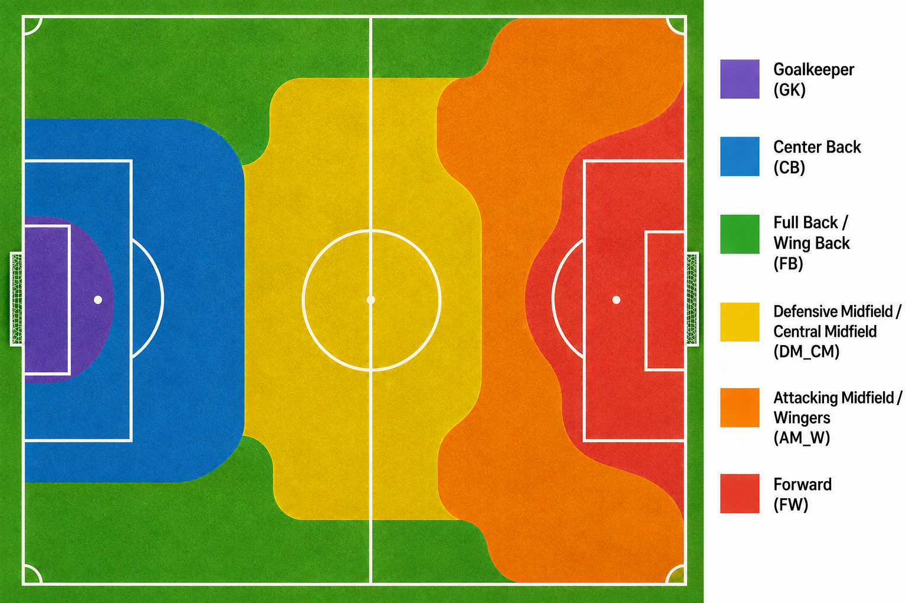
```

# Analiza nedostajućih vrednosti

Analiza je sprovedena nad skupom događaja (5.321.459 zapisa, 18 obeležja), a ne
nad izvedenom tabelom na nivou igrača, jer se agregacijom u brojače nedostajuće
vrednosti gube. Profil po kolonama dobija se jednim upitom, generisanim
programski nad imenima kolona:

```{r kod-na-profil}
cols <- colnames(ev)
na_sql <- paste(sprintf("SUM(CASE WHEN %s IS NULL THEN 1 ELSE 0 END) AS %s", cols, cols),
                collapse = ", ")
na_prof <- sdf_sql(sc, sprintf("SELECT COUNT(*) AS n_total, %s FROM ev_p", na_sql)) %>%
  collect()

na_tbl <- data.frame(
  kolona = cols,
  n_na   = as.numeric(na_prof[1, cols]),
  pct_na = round(100 * as.numeric(na_prof[1, cols]) / na_prof$n_total, 1)
)
na_tbl[order(-na_tbl$pct_na), ]
```

Pet obeležja nema nijednu nedostajuću vrednost, dok sedam ima udeo iznad 70%.
Nijedna nedostajuća vrednost nije posledica greške u prikupljanju — sve se
svrstavaju u četiri kategorije:

- **Strukturno odsustvo** — `shot_xg`, `shot_outcome`, `dribble_outcome`,
  `duel_type` i `pass_length` definisani su samo za odgovarajući tip događaja.
  Provera pokazuje savršeno poklapanje: `shot_xg` nedostaje u 5.283.571 zapisu,
  tačno onoliko koliko ima događaja koji nisu šut, dok među 37.888 šuteva ne
  nedostaje nijednom.
- **Semantičko odsustvo** — kod `pass_outcome` vrednost se upisuje samo kada
  dodavanje nije uspelo, pa NA označava uspeh. Od 1.481.813 dodavanja, 1.136.687
  nema upisan ishod, što daje tačnost od 76,7%. To je jedini slučaj u kojem bi
  naivno izostavljanje takvih zapisa dalo tačnost od 0% za sve igrače.
- **Logičko odsustvo** — bulovska obeležja `pass_goal_assist` i
  `pass_shot_assist` upisuju se samo kada je uslov ispunjen (2.596 asistencija i
  24.439 ključnih dodavanja).
- **Administrativni događaji** — *Half Start*, *Starting XI*, *Tactical Shift*:
  20.393 (0,4%) zapisa bez igrača i 37.460 (0,7%) bez koordinata.

Provera hipoteze o strukturnom odsustvu izvedena je poređenjem po tipu događaja:

```{r kod-na-provera}
# potvrda da shot_xg nedostaje tačno tamo gde događaj nije šut
sdf_sql(sc, "
  SELECT event_type, COUNT(*) AS n,
         ROUND(100.0 * SUM(CASE WHEN shot_xg IS NULL THEN 1 ELSE 0 END)/COUNT(*), 1) AS pct_na_xg,
         ROUND(100.0 * SUM(CASE WHEN loc_x   IS NULL THEN 1 ELSE 0 END)/COUNT(*), 1) AS pct_na_loc,
         ROUND(100.0 * SUM(CASE WHEN player_id IS NULL THEN 1 ELSE 0 END)/COUNT(*), 1) AS pct_na_player
  FROM ev_p GROUP BY event_type ORDER BY n DESC") %>% collect()

# potvrda da NA kod pass_outcome znači uspešno dodavanje
ev %>% filter(!is.na(pass_outcome)) %>% count(pass_outcome, sort = TRUE) %>% collect()
```

Nijedna metoda imputacije nije primenjena. Brojači su formirani uslovnim
sabiranjem po tipu događaja (strukturno odsustvo daje nulu), `pass_outcome IS
NULL` iskorišćen je kao definicija uspešnog dodavanja, zapisi bez igrača
isključeni su uslovom nad identifikatorom, a `AVG` i `STDDEV` zanemaruju
nedostajuće koordinate. **Konačna tabela na nivou igrača ne sadrži nijednu
nedostajuću vrednost.**

# Preliminarna analiza

Analiza je sprovedena na dva nivoa: nad skupom događaja (5.321.459 zapisa) u
sistemu Spark i nad izvedenom tabelom na nivou igrača (1.702 reda) u okruženju R.
Podela odgovara načelu paketa `sparklyr` — obrada se izvršava u Spark-u, a u R se
prikupljaju samo agregirani rezultati.

## Nivo događaja

Zabeležena su 33 tipa događaja, pri čemu dodavanje, prijem lopte i vođenje lopte
čine 74,8% svih zapisa.

| event_type | n |
|---|---|
| Pass | 1.481.813 |
| Ball Receipt* | 1.384.869 |
| Carry | 1.117.196 |
| Pressure | 491.104 |
| Ball Recovery | 162.682 |
| Duel | 125.123 |
| Clearance | 73.006 |
| Block | 59.169 |

*Tabela 1: Najčešći tipovi događaja*

Za vizualizaciju raspodela korišćen je paket **dbplot**, koji raspodelu po
intervalima izračunava u Spark-u i u R prenosi samo tabelu sa vrednostima po
intervalima, čime je izbegnuto prenošenje 1,48 miliona pojedinačnih vrednosti.

```{r kod-dbplot}
ev %>% filter(!is.na(pass_length)) %>%
  dbplot_histogram(pass_length, bins = 60) +
  labs(title = "Raspodela dužine dodavanja",
       subtitle = "1.481.813 dodavanja, agregacija izvršena u sistemu Spark",
       x = "Dužina dodavanja (jardi)", y = "Broj dodavanja")
ggsave("figures/A2_pass_length.png", width = 8, height = 5, dpi = 150)

ev %>% filter(!is.na(loc_x), !is.na(loc_y)) %>%
  dbplot_raster(loc_x, loc_y, resolution = 60) +
  scale_fill_viridis_c() +
  labs(title = "Gustina dodira po terenu", subtitle = "5,28 miliona zapisa",
       x = "Dužina terena", y = "Širina terena")
ggsave("figures/A3_heatmap.png", width = 9, height = 6, dpi = 150)
```

```{r a2, eval=TRUE, echo=FALSE, fig.cap="Slika 2: Histogram dužine dodavanja"}
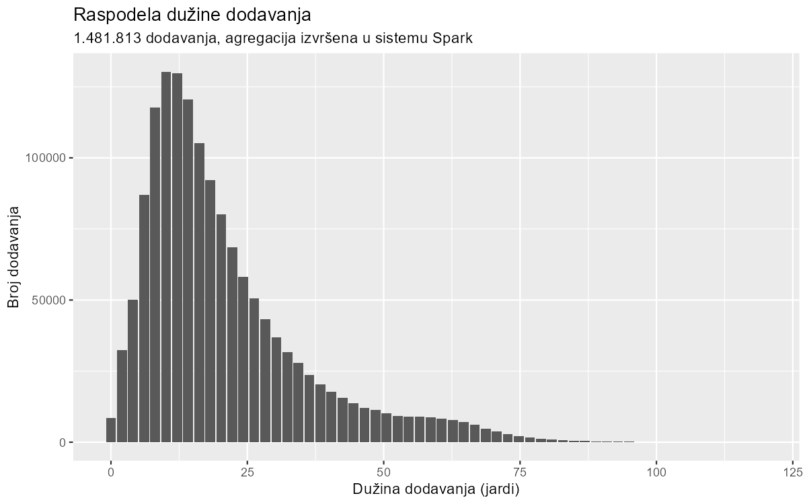
```

Raspodela dužine dodavanja izrazito je desno asimetrična, sa vrhom u opsegu
kratkih dodavanja i repom koji odgovara dugim loptama i centaršutevima.

```{r a3, eval=TRUE, echo=FALSE, fig.cap="Slika 3: Gustina dodira po terenu"}
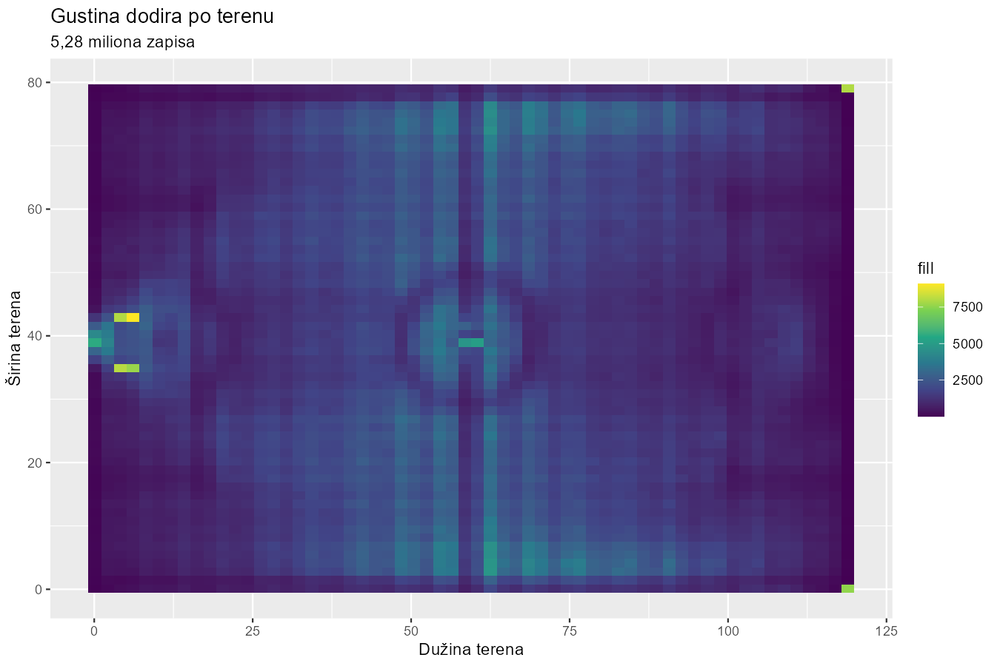
```

Za prikaz po pozicionim klasama koordinate su svedene na mrežu koraka četiri
jedinice, celobrojnim deljenjem **u okviru upita**, čime je skup od 5,28 miliona
zapisa sveden na nekoliko hiljada agregiranih ćelija pre prenošenja u R:

```{r kod-heatmap-pozicije}
grid <- sdf_sql(sc, "
  SELECT CASE
    WHEN position_name='Goalkeeper' THEN 'GK'
    WHEN position_name IN ('Right Center Back','Left Center Back','Center Back') THEN 'CB'
    WHEN position_name IN ('Left Back','Right Back','Left Wing Back','Right Wing Back') THEN 'FB'
    WHEN position_name IN ('Right Defensive Midfield','Left Defensive Midfield',
         'Center Defensive Midfield','Right Center Midfield','Left Center Midfield') THEN 'DM_CM'
    WHEN position_name IN ('Right Wing','Left Wing','Center Attacking Midfield',
         'Right Attacking Midfield','Right Midfield','Left Midfield') THEN 'AM_W'
    WHEN position_name IN ('Center Forward','Right Center Forward','Left Center Forward') THEN 'FW'
  END AS pos_grp,
  FLOOR(loc_x/4)*4 AS gx, FLOOR(loc_y/4)*4 AS gy, COUNT(*) AS n
  FROM ev_p WHERE loc_x IS NOT NULL AND position_name IS NOT NULL
  GROUP BY 1,2,3") %>% collect()

grid$pos_grp <- factor(grid$pos_grp, levels = c("GK","CB","FB","DM_CM","AM_W","FW"))
ggplot(grid, aes(gx, gy, fill = n)) + geom_tile() +
  facet_wrap(~ pos_grp) + scale_fill_viridis_c(trans = "sqrt") +
  labs(title = "Gustina dodira po pozicionoj klasi", x = NULL, y = NULL)
ggsave("figures/A4_heatmap_pozicije.png", width = 11, height = 7, dpi = 150)
```

```{r a4, eval=TRUE, echo=FALSE, fig.cap="Slika 4: Gustina dodira po pozicionoj klasi"}
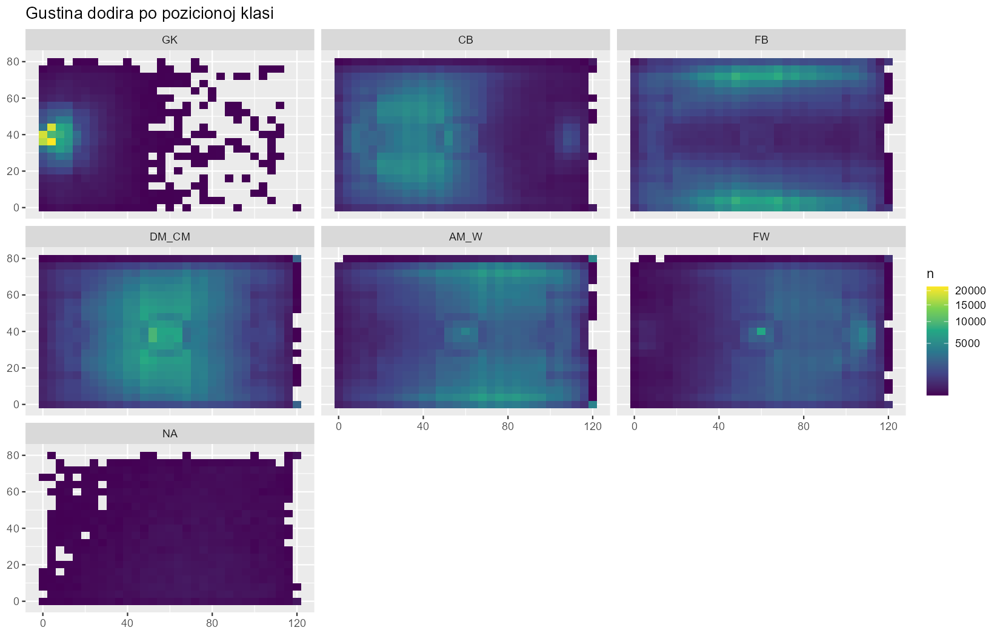
```

Prikaz po klasama pokazuje jasno razgraničene obrasce: golmani su isključivo u
sopstvenom kaznenom prostoru, štoperi ispred njega, bočni igrači duž bočnih
linija, vezni igrači imaju najravnomerniju raspodelu oko središnje ose, krila
ponavljaju obrazac bekova ali pomeren ka protivničkoj polovini, a napadači su
skoncentrisani u protivničkom kaznenom prostoru. Razlike su uočljive golim okom i
predstavljaju prvu potvrdu da su pozicione klase razlučive iz podataka. Prikaz
ujedno najavljuje gde se očekuju greške: bekovi i krila razlikuju se prevashodno
po položaju duž dužine terena, a ne po obliku obrasca, dok se štoperi i
defanzivni vezni preklapaju ispred sopstvenog kaznenog prostora.

## Deskriptivne statistike i raspodele

Za svako od 31 numeričkog obeležja izračunate su sredina, medijana, standardna
devijacija, minimum, maksimum i koeficijent asimetrije.

```{r kod-deskriptiva}
d <- read.csv("data/processed/player_features_labeled.csv", stringsAsFactors = FALSE)
d$position_group <- factor(d$position_group, levels = c("GK","CB","FB","DM_CM","AM_W","FW"))

num <- names(d)[sapply(d, is.numeric)]
num <- setdiff(num, c("player_id", "pos_purity", "purity6", "minutes"))

desc <- data.frame(
  obelezje   = num,
  sredina    = sapply(d[num], mean),
  medijana   = sapply(d[num], median),
  sd         = sapply(d[num], sd),
  min        = sapply(d[num], min),
  max        = sapply(d[num], max),
  asimetrija = sapply(d[num], e1071::skewness)
)
desc[, -1] <- round(desc[, -1], 3)
write.csv(desc, "results/deskriptiva.csv", row.names = FALSE)
```

```{r deskriptiva-tabela, eval=TRUE, echo=FALSE}
if (!is.null(deskriptiva)) {
  deskriptiva |> arrange(desc(abs(asimetrija))) |> head(12) |>
    tab("Tabela 2 — Dvanaest obeležja sa najizraženijom asimetrijom", digits = 3)
}
```

Ispravnost tabele proverena je poređenjem graničnih vrednosti sa pojedinačnim
slučajevima: najniža tačnost dodavanja iznosi 0,391 i pripada golmanu, što se
poklapa sa vrednošću iz faze pripreme. Najširi raspon ima `mean_x`, od 7,18 do
86,47, čime pokriva praktično celu dužinu terena.

```{r kod-raspodele}
d %>% select(all_of(num)) %>% pivot_longer(everything()) %>%
  ggplot(aes(value)) + geom_histogram(bins = 40) +
  facet_wrap(~ name, scales = "free", ncol = 5) +
  labs(title = "Raspodela obeležja na nivou igrača")
ggsave("figures/B2_raspodele.png", width = 15, height = 12, dpi = 130)
```

```{r b2, eval=TRUE, echo=FALSE, fig.cap="Slika 5: Histogrami svih obeležja na nivou igrača"}
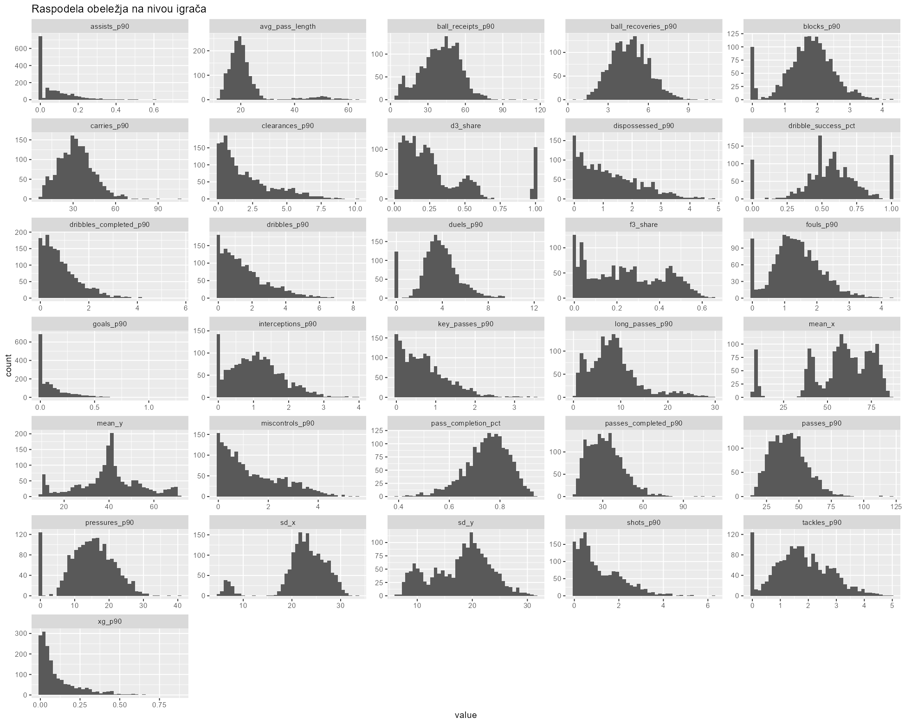
```

Pozitivna asimetrija najizraženija je kod `goals_p90` (2,29), `xg_p90` (1,96) i
`assists_p90` (1,87); kod golova sredina iznosi 0,113, a medijana 0,054, što
odražava stvarnu prirodu pojave. Negativna asimetrija kod `sd_x` (−1,58) i
`mean_x` (−1,08) posledica je prisustva golmana.

Transformacija obeležja nije sprovedena: stablo odlučivanja i slučajna šuma nisu
osetljivi na monotone transformacije, dok se kod metode k najbližih suseda uticaj
repova ublažava standardizacijom unutar cevovoda, u svakom preklopu unakrsne
validacije.

## Odnosi između obeležja

```{r kod-korelacije}
cm <- cor(d[num])
ggcorrplot::ggcorrplot(cm, hc.order = TRUE, type = "lower", tl.cex = 7) +
  labs(title = "Korelacije između obeležja")
ggsave("figures/B3_pirsonov_koeficijent_korelacije.png", width = 11, height = 10, dpi = 150)

# parovi sa apsolutnom korelacijom iznad 0,8
cp <- as.data.frame(as.table(cm))
cp <- cp[cp$Var1 != cp$Var2 & abs(cp$Freq) > 0.8, ]
cp <- cp[!duplicated(t(apply(cp[, 1:2], 1, sort))), ]
cp[order(-abs(cp$Freq)), ]
```

Izračunati su Pirsonovi koeficijenti korelacije za svih 465 parova obeležja, od
kojih 16 ima apsolutnu vrednost iznad 0,8. Najjače veze su `d3_share`–`mean_x`
(−0,980), `passes_completed_p90`–`passes_p90` (0,975) i
`dribbles_completed_p90`–`dribbles_p90` (0,956).

```{r b3, eval=TRUE, echo=FALSE, fig.cap="Slika 6: Pirsonovi koeficijenti korelacije"}
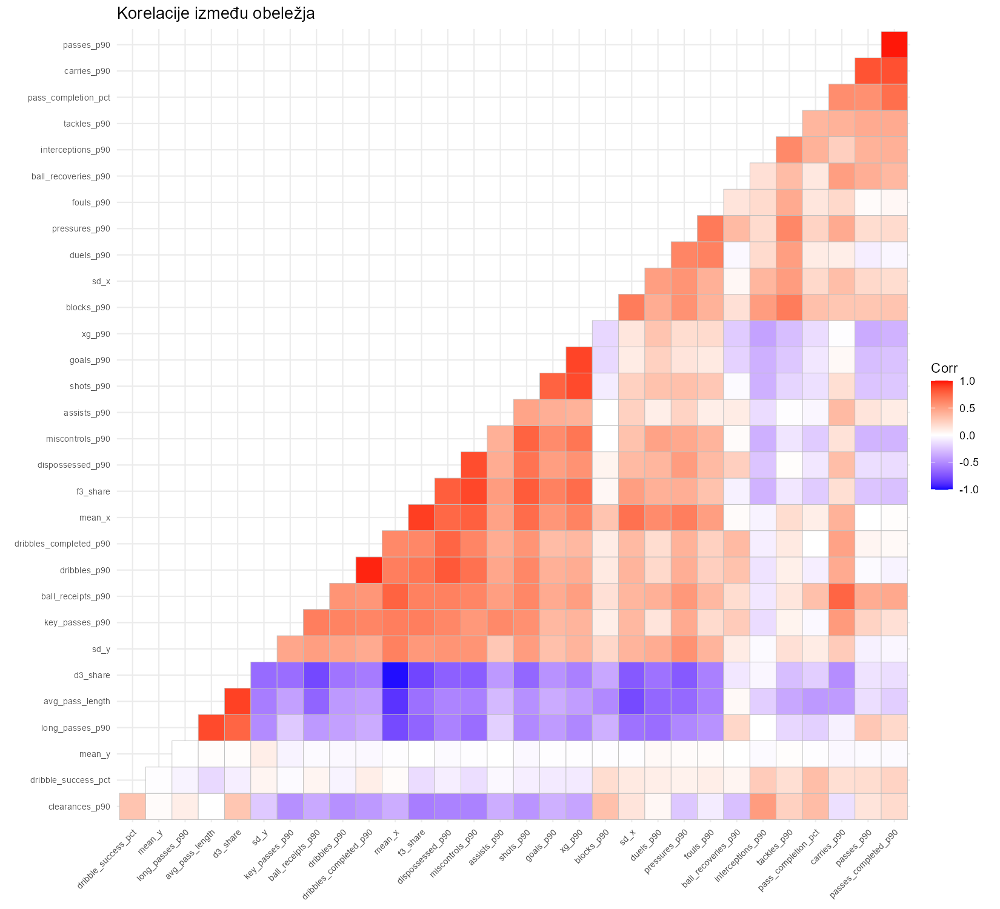
```

Iz skupa za modelovanje uklonjena su obeležja `passes_completed_p90` i
`dribbles_completed_p90`, koja predstavljaju proizvod odgovarajućeg brojača i
procenta uspešnosti, pa kod metoda zasnovanih na rastojanju uzrokuju višestruko
uračunavanje iste veličine. **Konačan skup sadrži 29 obeležja.** Par
`d3_share`–`mean_x` zadržan je u celini, jer nijedno nije izvedeno iz drugog i
oba su pri vrhu po diskriminativnoj moći; njihova redundansa obuhvaćena je
scenarijem sa redukcijom dimenzionalnosti.

Za ocenu diskriminativne moći primenjena je jednofaktorska analiza varijanse sa
pozicionom klasom kao faktorom:

```{r kod-anova}
fvals <- sapply(num, function(v) summary(aov(d[[v]] ~ d$position_group))[[1]][1, 4])
head(sort(fvals, decreasing = TRUE), 12)

top8 <- names(head(sort(fvals, decreasing = TRUE), 8))
d %>% select(position_group, all_of(top8)) %>%
  pivot_longer(-position_group) %>%
  ggplot(aes(position_group, value, fill = position_group)) +
  geom_boxplot(outlier.size = 0.4) + facet_wrap(~ name, scales = "free_y") +
  theme(legend.position = "none") +
  labs(title = "Obeležja koja najbolje razdvajaju pozicione klase", x = NULL)
ggsave("figures/B5_boxplot.png", width = 12, height = 8, dpi = 150)
```

| Obeležje | F | Obeležje | F |
|---|---|---|---|
| `d3_share` | 8.586,5 | `clearances_p90` | 1.523,1 |
| `mean_x` | 6.953,7 | `miscontrols_p90` | 1.069,5 |
| `avg_pass_length` | 3.036,9 | `pressures_p90` | 719,6 |
| `sd_x` | 2.601,0 | `shots_p90` | 695,4 |
| `f3_share` | 2.451,9 | `long_passes_p90` | 691,0 |

*Tabela 3: Obeležja koja najbolje razdvajaju pozicije (ANOVA F)*

Četiri od pet najdiskriminativnijih obeležja su prostorne prirode. Najjače
prostorno obeležje `d3_share` ima diskriminativnu moć 5,6 puta veću od najjačeg
brojača događaja `clearances_p90`. Pozicija igrača se, dakle, pouzdanije očitava
iz toga **gde** se igrač kreće nego iz toga **koje** akcije izvodi. Prostorna
obeležja nisu bila deo početne verzije tabele i uvedena su tek pri prelasku na
obradu u sistemu Spark.

```{r b5, eval=TRUE, echo=FALSE, fig.cap="Slika 7: Kutijasti dijagrami najdiskriminativnijih obeležja po klasama"}
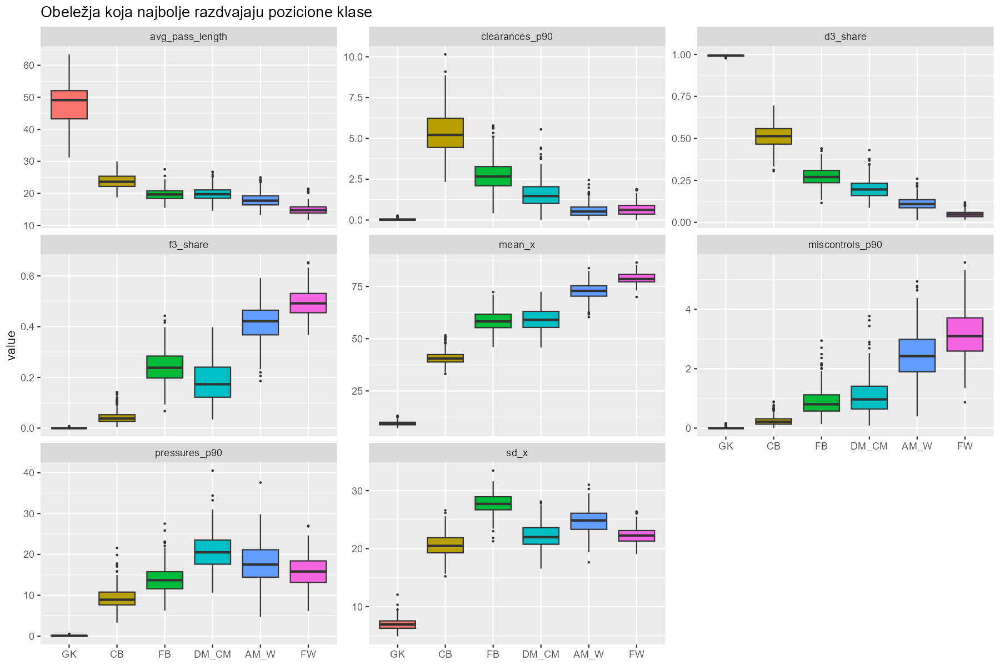
```

## Analiza glavnih komponenata

```{r kod-pca}
pca <- prcomp(d[num], scale. = TRUE)
ve <- round(100 * summary(pca)$importance[2, 1:5], 1); ve
which(cumsum(summary(pca)$importance[2, ]) >= 0.9)[1]   # broj komponenata za 90%

ggplot(data.frame(PC1 = pca$x[, 1], PC2 = pca$x[, 2], poz = d$position_group),
       aes(PC1, PC2, color = poz)) +
  geom_point(alpha = 0.6, size = 1.6) +
  labs(title = sprintf("PCA — PC1 %.1f%%, PC2 %.1f%%", ve[1], ve[2]))
ggsave("figures/B6_pca.png", width = 8, height = 6, dpi = 150)
```

Nad standardizovanim skupom prva glavna komponenta objašnjava 37,6% varijanse,
druga 18,7%, a treća 10,3%. Za obuhvatanje 90% varijanse potrebno je 11
komponenata, čime je brojčano potvrđena uočena redundansa; ta vrednost usvojena
je kao parametar za scenario sa redukcijom dimenzionalnosti. Prve dve komponente
nose 56,3%, dovoljno za dvodimenzionalni prikaz koji se kasnije koristi i za
prikaz klastera.

```{r b6, eval=TRUE, echo=FALSE, fig.cap="Slika 8: Analiza glavnih komponenata"}
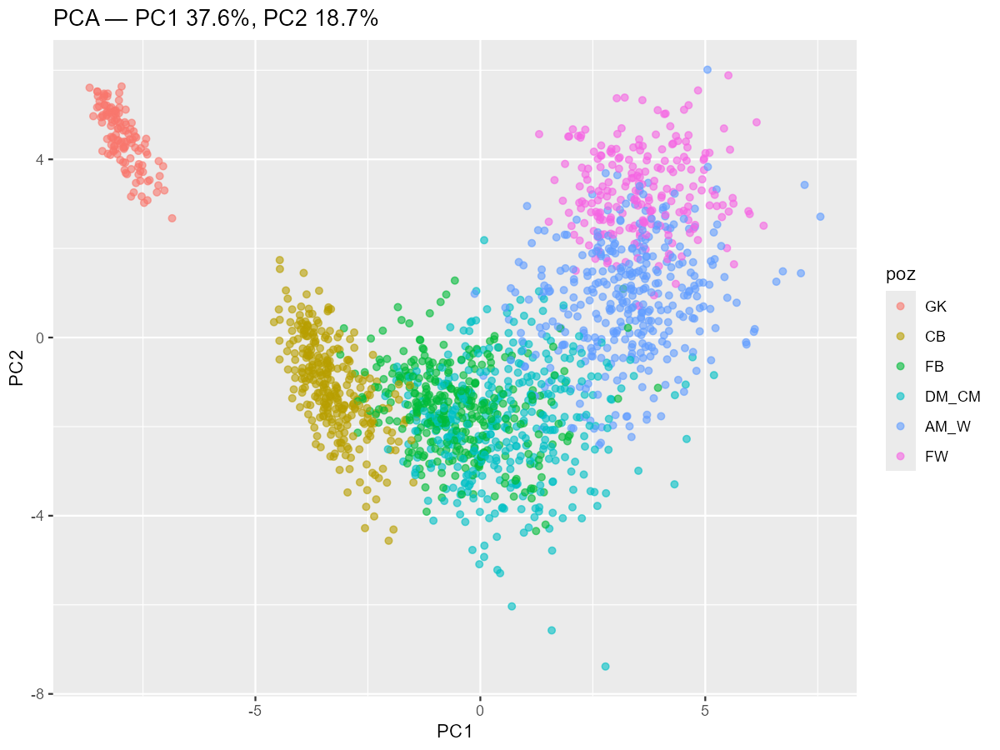
```

Golmani se izdvajaju kao potpuno odvojena grupa, bez ijednog preklapanja.
Preostalih pet klasa formira **kontinuum** duž prve komponente, poređan od
štopera preko bekova i veznih do krila i napadača, bez oštrih granica među
susednim klasama. Nalaz ukazuje da pozicione uloge nisu diskretne kategorije već
tačke na spektru, pa se očekuje da greške klasifikacije budu skoncentrisane
između susednih klasa.

# Priprema skupa za modelovanje

Priprema se izvršava jednom, a njeni rezultati koriste se nepromenjeni kod sva
tri klasifikaciona metoda, čime je obezbeđena uporedivost rezultata.

```{r kod-featcols}
num <- setdiff(names(d)[sapply(d, is.numeric)],
               c("player_id", "pos_purity", "purity6", "minutes"))
feat_cols <- setdiff(num, c("passes_completed_p90", "dribbles_completed_p90"))
saveRDS(feat_cols, "results/feat_cols.rds")   # 29 obeležja
```

Podaci su preneti u Spark funkcijom `copy_to` i podeljeni u odnosu 80 : 20. Test
skup se u fazi izbora modela i parametara ne koristi; njegova jedina namena je
ocena konačno izabranih rešenja.

Funkcija `sdf_random_split` ne obezbeđuje stratifikaciju po klasama. Kod
neuravnoteženog skupa u kojem najmanja klasa ima 125 redova, slučajna podela može
znatno odstupiti od željenog odnosa i učiniti nestabilnim ocene po klasama.
Podela je zato izvedena prozorskom funkcijom: svakom redu dodeljena je slučajna
vrednost sa fiksiranim semenom, unutar svake klase izračunat je procentualni rang
funkcijom `percent_rank`, a granica postavljena na 0,8.

```{r kod-split}
tbl <- copy_to(sc, d[, c("player", "team", "position_group", feat_cols)],
               "players", overwrite = TRUE)

strat <- tbl %>%
  group_by(position_group) %>%
  mutate(rk = percent_rank(rand(42L))) %>%
  ungroup()

train <- strat %>% filter(rk <= 0.8) %>% select(-rk) %>% compute("train")
test  <- strat %>% filter(rk >  0.8) %>% select(-rk) %>% compute("test")

spark_write_parquet(train, sp("data/interim/train"), mode = "overwrite")
spark_write_parquet(test,  sp("data/interim/test"),  mode = "overwrite")
```

| Klasa | Ukupno | Trening | Test | Udeo u treningu |
|---|---|---|---|---|
| GK | 125 | 100 | 25 | 80,0% |
| CB | 300 | 240 | 60 | 80,0% |
| FB | 332 | 265 | 67 | 79,8% |
| DM_CM | 368 | 294 | 74 | 79,9% |
| AM_W | 360 | 288 | 72 | 80,0% |
| FW | 217 | 173 | 44 | 79,7% |
| **Ukupno** | **1.702** | **1.360** | **342** | **79,9%** |

*Tabela 4: Ostvarena podela po pozicionim klasama*

Udeo trening dela iznosi između 79,7% i 80,0% u svakoj klasi, uključujući i
najmanju, čime je stratifikacija u potpunosti ostvarena. Obe tabele snimljene su
u Parquet format, pa i metod k najbližih suseda, koji se izvršava u R okruženju,
koristi istovetnu podelu. Seme slučajnog generatora fiksirano je na 42 radi
potpune ponovljivosti.

# Klasifikacija

## Zajednička postavka

Za isto ciljno obeležje formirana su tri klasifikaciona modela: **stablo
odlučivanja**, **slučajna šuma** i **metod k najbližih suseda**. Sva tri koriste
istih 29 obeležja i istovetnu podelu, pa razlike u rezultatima potiču isključivo
od samih metoda.

Stablo i šuma realizovani su kroz `ml_pipeline` sa četiri stadijuma:

```{r kod-pipeline}
base_pipeline <- ml_pipeline(sc) %>%
  ft_string_indexer("position_group", "label") %>%                    # tekst -> brojčana labela
  ft_vector_assembler(input_cols = feat_cols, output_col = "features_raw") %>%
  ft_standard_scaler("features_raw", "features",
                     with_mean = TRUE, with_std = TRUE)

evaluator <- ml_multiclass_classification_evaluator(
  sc, label_col = "label", prediction_col = "prediction", metric_name = "f1")

run_cv <- function(grid, pipe) {
  cv <- ml_cross_validator(sc, estimator = pipe, estimator_param_maps = grid,
                           evaluator = evaluator, num_folds = 10,
                           parallelism = 4, seed = 42)
  ml_fit(cv, train)
}
```

Smeštanje standardizacije **unutar** cevovoda ima metodološku posledicu. Pošto se
ceo cevovod prosleđuje objektu za unakrsnu validaciju kao jedinstvena celina,
parametri standardizacije prilagođavaju se iznova u svakom od deset preklopa, i
to isključivo nad podacima za obučavanje u tom preklopu. Time je isključeno
curenje informacija do kojeg bi došlo da je standardizacija sprovedena nad celim
trening skupom pre podele na preklope.

Standardizacija za stablo i šumu nije neophodna, jer se odluke o grananju donose
poređenjem sa pragovima. Zadržana je da bi sva tri metoda koristila istovetnu
pripremu.

Kao mera performansi korišćena je **težinska F1 mera**, izabrana umesto proste
tačnosti zbog neuravnoteženosti klasa, gde odnos najbrojnije i najmanje brojne
klase iznosi 2,9 : 1. Unakrsna validacija sprovedena je sa deset preklopa, uz
`parallelism = 4` — preklopi su međusobno nezavisni, pa je posao gotovo idealno
paralelan.

Biblioteka Spark MLlib **nema klasifikator k najbližih suseda** — postoji samo
aproksimacija susedstva zasnovana na LSH, bez klasifikacione glave. Taj metod je
zato realizovan u R-u, paketom `kknn`.

## Stablo odlučivanja

```{r kod-dt-mreze}
pipe_dt <- base_pipeline %>%
  ml_decision_tree_classifier(features_col = "features", label_col = "label")

g1 <- list(decision_tree = list(max_depth = c(2, 3, 5, 8, 12, 20)))
g2 <- list(decision_tree = list(min_instances_per_node = c(1, 5, 10, 20, 50),
                                min_info_gain = c(0, 0.001, 0.01)))
g3 <- list(decision_tree = list(impurity = c("gini", "entropy"),
                                max_depth = c(5, 10, 15)))

t1 <- system.time(cv1 <- run_cv(g1, pipe_dt))
t2 <- system.time(cv2 <- run_cv(g2, pipe_dt))
t3 <- system.time(cv3 <- run_cv(g3, pipe_dt))

vm1 <- ml_validation_metrics(cv1) %>% arrange(desc(f1))
vm2 <- ml_validation_metrics(cv2) %>% arrange(desc(f1))
vm3 <- ml_validation_metrics(cv3) %>% arrange(desc(f1))
```

Imena kolona koja vraća `ml_validation_metrics` nose sufiks faze cevovoda
(`max_depth_1`), pa se ne mogu tvrdo upisati u kod za crtanje. Pomoćna funkcija
pronalazi ime po obrascu:

```{r kod-pick}
pick <- function(vm, pat) names(vm)[grepl(pat, names(vm), ignore.case = TRUE)][1]

ggplot(vm1, aes(.data[[pick(vm1, "max_depth")]], f1)) +
  geom_line(linewidth = 0.8) + geom_point(size = 2.5) +
  labs(title = "Stablo odlučivanja, scenario 1: dubina stabla",
       subtitle = "F1 mera, 10-struka unakrsna validacija",
       x = "Maksimalna dubina", y = "F1")
ggsave("figures/DT_S1.png", width = 7, height = 4.5, dpi = 150)
```

### Scenario 1 — dubina stabla

```{r dt-s1, eval=TRUE, echo=FALSE}
tab(dt_s1, "Tabela 5 — Stablo odlučivanja, scenario 1: maksimalna dubina")
```

```{r dt-s1-fig, eval=TRUE, echo=FALSE, fig.cap="Slika 9: Stablo odlučivanja, uticaj maksimalne dubine"}
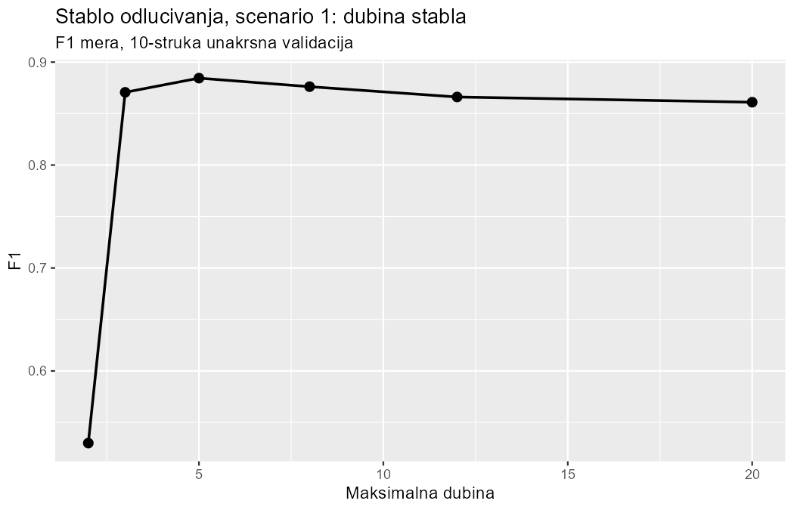
```

Kriva pokazuje jasno izražen kompromis između pristrasnosti i varijanse. Pri
dubini 2 stablo raspolaže sa najviše četiri lista, što nije dovoljno za
razlikovanje šest klasa, pa F1 mera pada na 0,5299. Prelaskom na dubinu 3
performanse naglo rastu, dostižu maksimum pri dubini 5, a nakon toga blago i
postojano opadaju, što ukazuje na preprilagođavanje. U opsegu od dubine 3 do 20
razlika između najbolje i najniže vrednosti iznosi svega 2,3 procentna poena, iz
čega sledi da izbor dubine, pod uslovom da nije trivijalno mala, nije presudan.

### Scenario 2 — uslovi zaustavljanja grananja

```{r dt-s2, eval=TRUE, echo=FALSE}
tab(dt_s2, "Tabela 6 — Stablo odlučivanja, scenario 2: uslovi zaustavljanja")
```

```{r dt-s2-fig, eval=TRUE, echo=FALSE, fig.cap="Slika 10: Stablo odlučivanja, uslovi zaustavljanja grananja"}
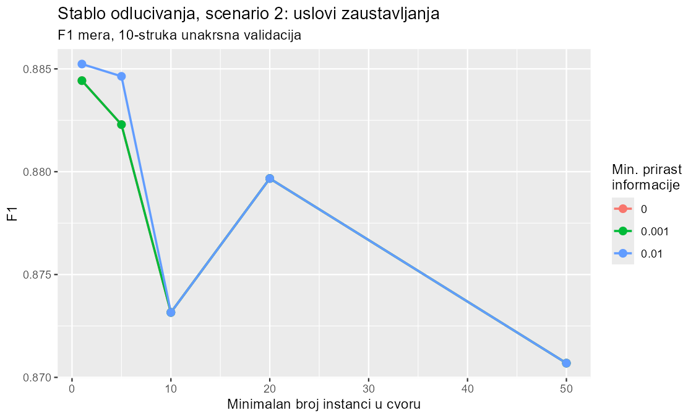
```

Parametar `min_info_gain` praktično ne utiče na rezultat: vrednosti 0 i 0,001
daju istovetne rezultate u svim slučajevima, dok 0,01 donosi razliku samo pri
najmanjim vrednostima drugog parametra. Grananja koja stablo bira već su dovoljno
informativna, pa prag prirasta informacije retko postaje aktivno ograničenje. Na
slici kriva za vrednost 0 nije vidljiva jer je u potpunosti prekrivena preostalim
dvema — to nije nedostatak prikaza, nego posledica istovetnosti rezultata.

Povećanje minimalnog broja instanci u čvoru u celini smanjuje F1 meru, sa 0,8852
pri vrednosti 1 na 0,8707 pri vrednosti 50, mada opadanje nije strogo monotono.
Ukupan raspon svih 15 kombinacija iznosi 1,5 procentnih poena.

### Scenario 3 — kriterijum grananja

```{r dt-s3, eval=TRUE, echo=FALSE}
tab(dt_s3, "Tabela 7 — Stablo odlučivanja, scenario 3: kriterijum nečistoće")
```

```{r dt-s3-fig, eval=TRUE, echo=FALSE, fig.cap="Slika 11: Stablo odlučivanja, Gini indeks naspram entropije"}
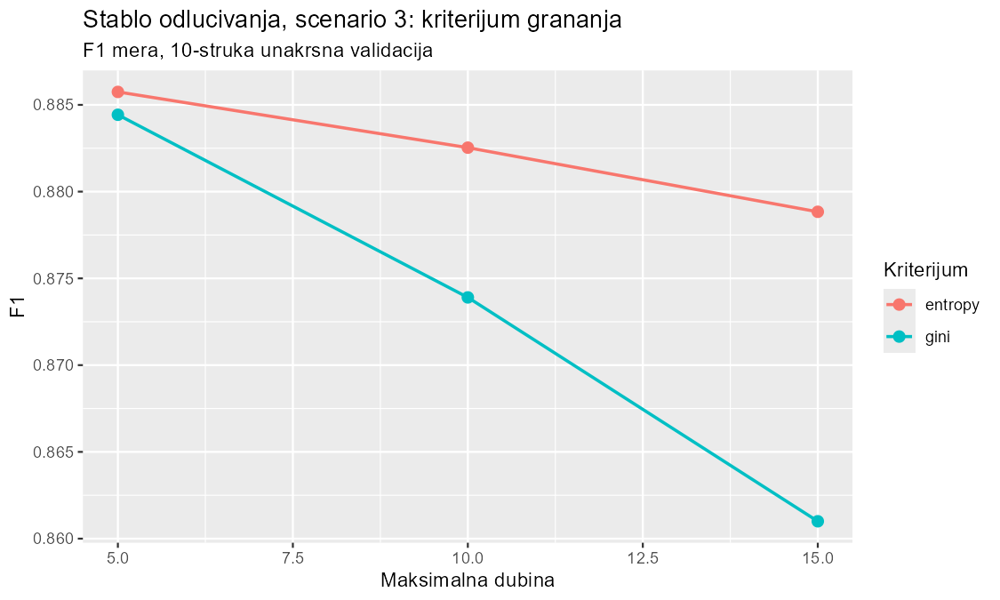
```

Entropija daje bolji rezultat pri svim ispitanim dubinama, pri čemu prednost
raste sa dubinom: 0,13 procentnih poena pri dubini 5, zatim 0,86 pri dubini 10 i
1,78 pri dubini 15. Objašnjenje je u tome što entropija jače kažnjava nečistoću
čvora nego Gini indeks, pa pri većim dubinama, kada čvorovi obuhvataju manji broj
primeraka, donosi opreznije odluke o grananju i sporije se preprilagođava. Pri
manjim dubinama razlika je zanemarljiva, što je saglasno sa opšte prihvaćenim
nalazom da izbor kriterijuma nečistoće retko bitno utiče na performanse stabla.

### Izbor rešenja i ocena na test skupu

Najbolji scenario bira se po najvišoj prosečnoj F1 meri iz unakrsne validacije, a
`best_model` je već ponovo obučen nad celim trening skupom:

```{r kod-dt-izbor}
best_f1   <- c(S1 = max(vm1$f1), S2 = max(vm2$f1), S3 = max(vm3$f1))
best_scen <- names(which.max(best_f1))
best_cv   <- list(S1 = cv1, S2 = cv2, S3 = cv3)[[best_scen]]
best_model <- best_cv$best_model
```

Model predviđa numeričke oznake, pa se pre matrice konfuzije mora rekonstruisati
rečnik indeks → naziv klase:

```{r kod-dt-test}
map_lab <- ml_transform(best_model, train) %>%
  select(position_group, label) %>% distinct() %>% collect()

preds <- ml_transform(best_model, test) %>%
  select(position_group, label, prediction) %>% collect() %>%
  left_join(map_lab, by = c("prediction" = "label"), suffix = c("", "_pred")) %>%
  rename(pred_group = position_group_pred)

lvl <- c("GK","CB","FB","DM_CM","AM_W","FW")   # redosled od odbrane ka napadu
cm <- caret::confusionMatrix(factor(preds$pred_group,     levels = lvl),
                             factor(preds$position_group, levels = lvl))
```

Redosled nivoa nije azbučni nego od odbrane ka napadu, kako bi struktura grešaka
u matrici bila vidljiva.

Poređenjem najboljih rezultata po scenarijima — 0,8844 za prvi, 0,8852 za drugi i
0,8857 za treći — izabran je model iz trećeg scenarija, sa kriterijumom entropije
i maksimalnom dubinom 5. Najbolji rezultati sva tri scenarija razlikuju se za
manje od 0,15 procentnih poena, iz čega sledi da je metod dostigao svoj plafon na
raspoloživim podacima.

| Pokazatelj | Vrednost |
|---|---|
| F1 iz unakrsne validacije (10 preklopa) | 0,8857 |
| Tačnost na test skupu | 0,9123 |
| 95% interval poverenja | (0,877 – 0,940) |
| Koenov koeficijent kapa | 0,8926 |
| Makro preciznost | 0,9276 |
| Makro odziv | 0,9191 |
| Makro F1 | 0,9226 |
| Balansirana tačnost | 0,9504 |
| Višeklasni AUC (Hand–Till) | 0,9776 |
| Vreme obučavanja jednog modela | 2,6 s |
| Vreme predviđanja nad test skupom | 0,5 s |
| Broj obučenih modela u pretrazi | 273 |

*Tabela 8: Pokazatelji performansi izabranog stabla odlučivanja*

Tačnost od 91,2% znatno nadmašuje stopu većinske klase od 21,6%, uz p < 0,001.
Vrednost Koenovog koeficijenta kapa od 0,8926 pokazuje gotovo savršeno slaganje
sa stvarnim labelama.

Višeklasni AUC jedini je pokazatelj koji se ne izvodi iz matrice konfuzije.
Preostale mere ocenjuju konačnu odluku modela, dok se AUC računa iz raspodele
verovatnoća po klasama i meri koliko pouzdano model razdvaja klase pre donošenja
odluke. Verovatnoće se dobijaju razlaganjem vektorske kolone `probability`:

```{r kod-auc}
probs <- ml_transform(best_model, test) %>%
  sdf_separate_column("probability", into = paste0("p", 0:5)) %>%
  select(label, p0, p1, p2, p3, p4, p5) %>% collect()

pmat <- as.matrix(probs[, paste0("p", 0:5)])
colnames(pmat) <- as.character(0:5)

auc <- pROC::multiclass.roc(response = factor(probs$label, levels = 0:5),
                            predictor = pmat)
```

Makro F1 na test skupu (0,9226) veća je od vrednosti iz unakrsne validacije
(0,8857). Razlika ima dva izvora: unakrsna validacija obučava svaki model nad
devet desetina trening skupa, pa daje blago pesimističnu procenu, a primenjene
mere nisu istovetne — Spark računa F1 ponderisanu brojem primeraka po klasi, dok
je makro F1 prosta aritmetička sredina po klasama, koju klasa golmana sa savršenim
rezultatom podiže.

```{r dt-po-klasi, eval=TRUE, echo=FALSE}
tab(dt_po_klasi, "Tabela 9 — Stablo odlučivanja: performanse po pozicionim klasama")
```

Klasa golmana klasifikovana je savršeno po svim pokazateljima. Taj rezultat ne
predstavlja stvarno dostignuće modela: golmani imaju vrednosti obeležja koje se
ne preklapaju ni sa jednom drugom klasom, što je uočljivo i na dijagramu glavnih
komponenata. Klasa se stoga u tumačenju tretira kao trivijalna, uz napomenu da
podiže vrednosti makro mera.

Najteža je klasa ofanzivnih veznih i krilnih igrača, sa F1 merom od 0,8630. Ta
klasa greši u oba smera prema obema susednim klasama. Klasa defanzivnih i
centralnih veznih igrača ima najnižu preciznost uz visok odziv, iz čega sledi da
model ima sklonost da u nju svrstava granične slučajeve.

```{r dt-confusion, eval=TRUE, echo=FALSE, fig.cap="Slika 12: Matrica konfuzije — stablo odlučivanja"}
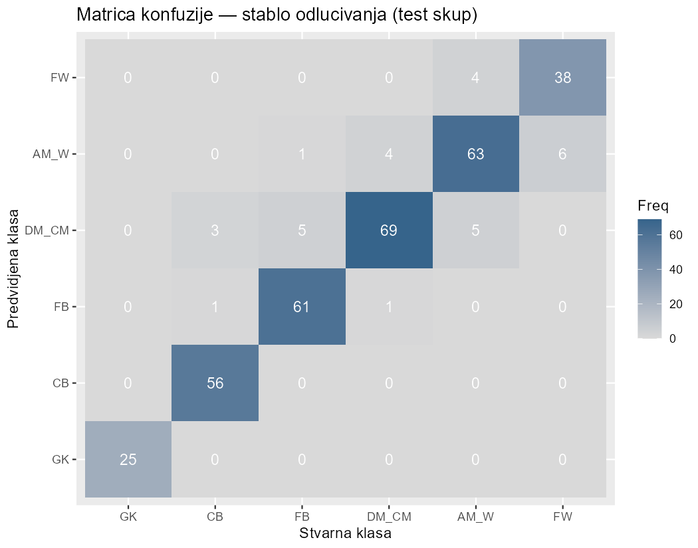
```

Od 342 primerka tačno je klasifikovano 312, a pogrešno 30. Sve popunjene ćelije
smeštene su na dijagonali ili u njenoj neposrednoj blizini, dok su uglovi matrice
prazni. **Dvadeset devet od 30 grešaka javlja se između klasa koje su susedne na
spektru odbrana–napad.** Jedini izuzetak je bočni odbrambeni igrač svrstan među
krila; ni taj slučaj nije proizvoljan, jer bekovi i krila dele obrazac kretanja
duž bočnih linija.

U specifikaciji projekta pretpostavljeno je da će najčešće greške biti između
srodnih pozicija, uz primer bekova i štopera. Hipoteza je potvrđena u opštem
obliku, ali navedeni primer nije: par štoperi–bekovi ima svega jednu grešku i
spada među najbolje razdvojene. Dominantne zabune javljaju se u napadačkom delu
spektra.

Struktura izabranog stabla i značaj obeležja čitaju se direktno iz Scala objekta
kroz JVM most, jer sparklyr ne izlaže sve MLlib metode:

```{r kod-dt-struktura}
dt_stage <- ml_stage(best_model, 4)          # 4. faza cevovoda je klasifikator
imp <- spark_jobj(dt_stage) %>% invoke("featureImportances") %>% invoke("toArray")

imp_df <- data.frame(obelezje = feat_cols, znacaj = round(imp, 4)) %>%
  arrange(desc(znacaj))

cat("Dubina:", invoke(spark_jobj(dt_stage), "depth"),
    "| Broj čvorova:", invoke(spark_jobj(dt_stage), "numNodes"), "\n")

writeLines(invoke(spark_jobj(dt_stage), "toDebugString"),
           "results/dt_tree_structure.txt")   # celo stablo kao skup pravila
```

```{r dt-importance, eval=TRUE, echo=FALSE, fig.cap="Slika 13: Značaj obeležja — stablo odlučivanja"}
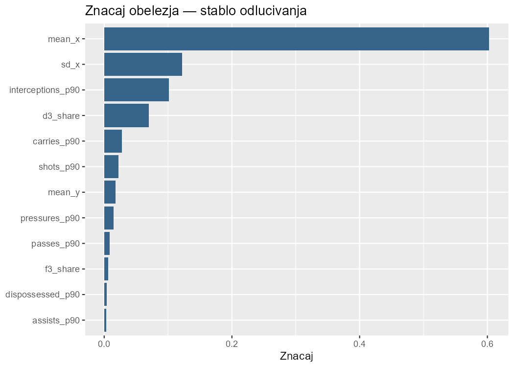
```

Izabrano stablo ima dubinu 5 i ukupno 33 čvora, od čega 16 unutrašnjih grananja i
17 listova. Prva četiri obeležja nose 89,6% ukupnog značaja, pri čemu `mean_x`
samostalno nosi 60,3% — više od svih preostalih 28 obeležja zajedno.

Poređenje sa analizom varijanse otkriva dve pojave. Prvo, **korelisana obeležja
se međusobno potiskuju**: `d3_share` je bilo najdiskriminativnije pojedinačno,
ali korelira −0,980 sa `mean_x`, koje stablo bira pri prvom grananju i time
iscrpljuje tu informaciju. Drugo, **stablo nagrađuje dopunsku informaciju**:
`interceptions_p90` nije bilo među prvih dvanaest po analizi varijanse, ali je
treće po značaju u stablu, jer razlikuje defanzivnog veznog od bočnog
odbrambenog igrača, koji se kreću na sličnoj udaljenosti od sopstvenog gola.

## Slučajna šuma

Korišćen je istovetan cevovod, sa izmenom isključivo u četvrtom stadijumu.
Slučajna šuma sadrži dva izvora slučajnosti — uzorkovanje instanci pri gradnji
svakog stabla i izbor podskupa obeležja pri svakom grananju — pa je seme
fiksirano na 42.

```{r kod-rf-mreze}
pipe_rf <- base_pipeline %>%
  ml_random_forest_classifier(features_col = "features", label_col = "label",
                              seed = 42)

# S1: veličina ansambla
g1 <- list(random_forest = list(num_trees = c(20, 50, 100, 250, 500)))
# S2: složenost pojedinačnog stabla x jačina dekorelacije (uzorkovanje KOLONA)
g2 <- list(random_forest = list(max_depth = c(3, 5, 10, 15),
                                feature_subset_strategy = c("sqrt","log2","onethird")))
# S3: agresivnost uzorkovanja REDOVA x predorezivanje
g3 <- list(random_forest = list(subsampling_rate = c(0.6, 0.8, 1.0),
                                min_instances_per_node = c(1, 5, 20)))

t1 <- system.time(cv1 <- run_cv(g1, pipe_rf))
t2 <- system.time(cv2 <- run_cv(g2, pipe_rf))
t3 <- system.time(cv3 <- run_cv(g3, pipe_rf))
```

### Scenario 1 — broj stabala u ansamblu

```{r rf-s1, eval=TRUE, echo=FALSE}
tab(rf_s1, "Tabela 10 — Slučajna šuma, scenario 1: broj stabala")
```

```{r rf-s1-fig, eval=TRUE, echo=FALSE, fig.cap="Slika 14: Slučajna šuma, uticaj broja stabala"}
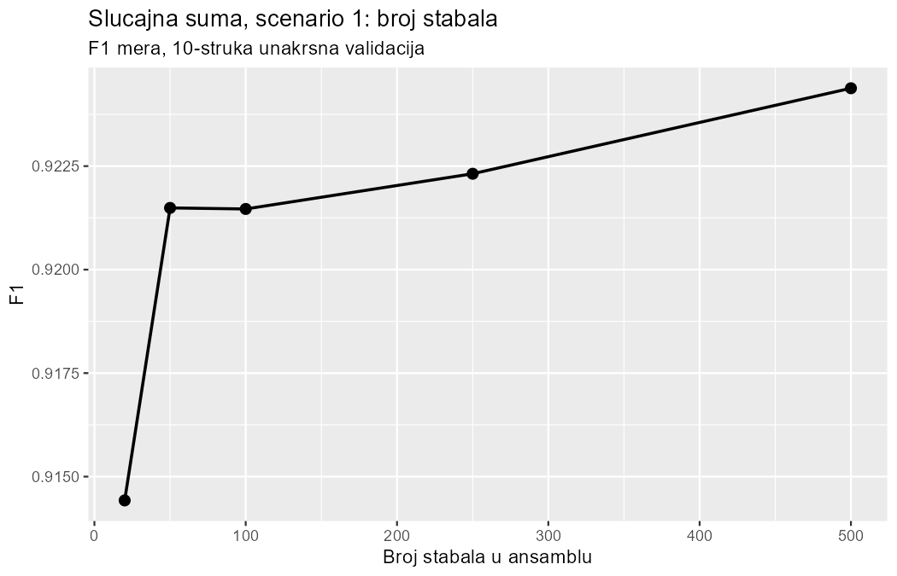
```

Najveći dobitak ostvaruje se prelaskom sa 20 na 50 stabala, gde F1 raste za 0,71
procentnih poena. Nakon toga kriva se izravnava: desetostruko povećanje ansambla,
sa 50 na 500 stabala, donosi dodatnih svega 0,29 procentnih poena. Ansambl
smanjuje varijansu usrednjavanjem, pri čemu je smanjenje srazmerno recipročnoj
vrednosti broja stabala, pa dobitak brzo opada. Za razliku od dubine, povećanje
broja stabala **ne dovodi do preprilagođavanja**, što se vidi iz odsustva pada u
desnom delu krive.

### Scenario 2 — dubina stabla i podskup obeležja

Parametar `feature_subset_strategy` određuje koliko se obeležja nasumično
razmatra pri **svakom grananju**: `sqrt` daje ⌈√29⌉ = 6 obeležja, `log2`
⌈log₂29⌉ = 5, a `onethird` ⌈29/3⌉ = 10. Reč je o uzorkovanju kolona, za razliku
od `subsampling_rate` iz sledećeg scenarija, koje uzorkuje redove.

```{r rf-s2, eval=TRUE, echo=FALSE}
tab(rf_s2, "Tabela 11 — Slučajna šuma, scenario 2: dubina i podskup obeležja")
```

```{r rf-s2-fig, eval=TRUE, echo=FALSE, fig.cap="Slika 15: Slučajna šuma, dubina i strategija izbora obeležja"}
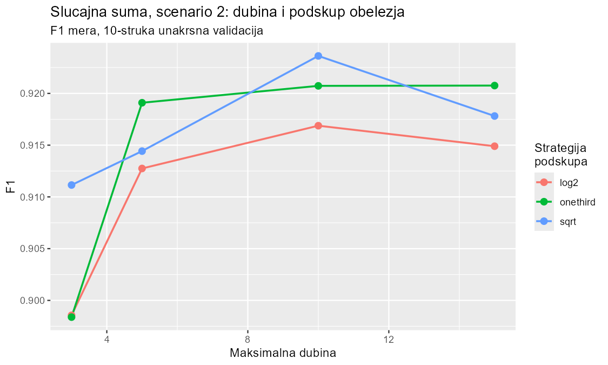
```

Uočljive su tri pravilnosti. Plitka stabla dubine 3 daju najlošije rezultate pri
svim strategijama, jer pojedinačno stablo sa najviše osam listova ne može
razlikovati šest klasa, pa ni usrednjavanje ne otklanja tu ograničenost.
Strategija `log2` daje najlošije rezultate na svim dubinama osim najmanje — sa
jednim obeležjem manje po grananju uvodi više slučajnosti nego što je korisno.
Konačno, `sqrt` dostiže vrh pri dubini 10 i zatim opada, dok se `onethird` na
dubinama 10 i 15 izravnava: manji podskup uvodi veću raznovrsnost, pa se pri
velikim dubinama pojedinačna stabla više preprilagođavaju.

### Scenario 3 — udeo uzorkovanja i minimalna veličina čvora

```{r rf-s3, eval=TRUE, echo=FALSE}
tab(rf_s3, "Tabela 12 — Slučajna šuma, scenario 3: uzorkovanje i veličina čvora")
```

```{r rf-s3-fig, eval=TRUE, echo=FALSE, fig.cap="Slika 16: Slučajna šuma, udeo uzorkovanja i minimalna veličina čvora"}
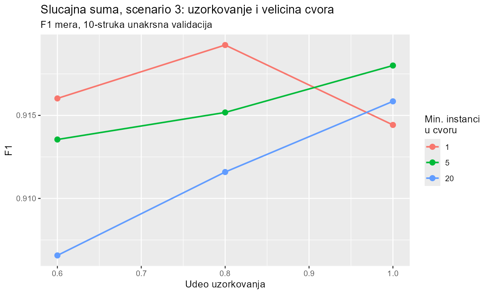
```

Uticaj oba parametra je slab — ukupan raspon svih devet kombinacija iznosi 1,26
procentnih poena. Vrednost `min_instances_per_node` jednaka 20 daje najlošije
rezultate pri svim udelima uzorkovanja, jer prerano zaustavlja grananje i time
smanjuje raznovrsnost među stablima, koja je osnovni izvor prednosti ansambla.
Pri najmanjoj vrednosti minimalne veličine čvora javlja se vrh pri udelu 0,8, dok
pri većim vrednostima F1 raste monotono do 1,0: kada su stabla neograničena po
veličini čvora, delimično uzorkovanje unosi potrebnu raznovrsnost, dok pri već
ograničenim stablima samo smanjuje količinu podataka.

### Izbor rešenja i ocena na test skupu

Parametri izabranog modela ne prepisuju se ručno, nego se čitaju iz samog modela
i prosleđuju finalnom obučavanju:

```{r kod-rf-parametri}
rf_stage <- ml_stage(best_model, 4)
cat("num_trees:",   invoke(spark_jobj(rf_stage), "getNumTrees"), "\n")
cat("max_depth:",   invoke(spark_jobj(rf_stage), "getMaxDepth"), "\n")
cat("subset:",      invoke(spark_jobj(rf_stage), "getFeatureSubsetStrategy"), "\n")
cat("ukupno čvorova:", invoke(spark_jobj(rf_stage), "totalNumNodes"), "\n")

pipe_best <- base_pipeline %>%
  ml_random_forest_classifier(
    features_col = "features", label_col = "label", seed = 42,
    num_trees               = invoke(spark_jobj(rf_stage), "getNumTrees"),
    max_depth               = invoke(spark_jobj(rf_stage), "getMaxDepth"),
    feature_subset_strategy = invoke(spark_jobj(rf_stage), "getFeatureSubsetStrategy"),
    subsampling_rate        = invoke(spark_jobj(rf_stage), "getSubsamplingRate"),
    min_instances_per_node  = invoke(spark_jobj(rf_stage), "getMinInstancesPerNode"))

t_fit  <- system.time(final_model <- ml_fit(pipe_best, train))
t_pred <- system.time(ml_transform(final_model, test) %>% sdf_nrow())  # sdf_nrow tera izvršavanje
```

Izabran je model iz prvog scenarija: 500 stabala, maksimalna dubina 5, strategija
`auto` (što za klasifikaciju odgovara vrednosti `sqrt`), pun udeo uzorkovanja i
minimalna veličina čvora 1. Ansambl ukupno sadrži 21.544 čvora.

Razlika između prvog i drugog scenarija iznosi svega 0,08 procentnih poena, pa se
rezultati mogu smatrati praktično jednakim. Treba napomenuti i **ograničenje
sprovedene pretrage**: u prvom scenariju menjan je samo broj stabala, pri čemu je
dubina ostala na podrazumevanoj vrednosti 5, dok je drugi scenario pokazao da je
dubina 10 povoljnija. Kombinacija velikog broja stabala i veće dubine nije
ispitana, budući da su scenariji, u skladu sa zahtevom, definisani kao odvojene
celine. Moguće je da bi takva kombinacija dala nešto bolji rezultat.

| Pokazatelj | Vrednost |
|---|---|
| F1 iz unakrsne validacije (10 preklopa) | 0,9244 |
| Tačnost na test skupu | 0,9415 |
| 95% interval poverenja | (0,911 – 0,964) |
| Koenov koeficijent kapa | 0,9284 |
| Makro preciznost | 0,9513 |
| Makro odziv | 0,9448 |
| Makro F1 | 0,9476 |
| Balansirana tačnost | 0,9663 |
| Višeklasni AUC (Hand–Till) | 0,9966 |
| Vreme obučavanja jednog modela | 6,21 s |
| Vreme predviđanja nad test skupom | 0,42 s |
| Ukupan broj čvorova u ansamblu | 21.544 |
| Broj obučenih modela u pretrazi | 263 |

*Tabela 13: Pokazatelji performansi izabrane slučajne šume*

Slučajna šuma nadmašuje stablo odlučivanja po svim pokazateljima. Tačnost je viša
za 2,9 procentnih poena, makro F1 za 2,5, a kapa za 3,6. Broj pogrešno
klasifikovanih primeraka smanjen je sa 30 na 20, dakle za trećinu.

Posebno je izražena razlika u vrednosti AUC pokazatelja, koja raste sa 0,9776 na
0,9966. Budući da se taj pokazatelj računa iz raspodele verovatnoća, njegov
porast pokazuje da ansambl ne samo da donosi tačnije odluke, već ih donosi i sa
bolje kalibrisanim stepenom sigurnosti — verovatnoće nastaju usrednjavanjem
predviđanja 500 stabala, pa su znatno finije stepenovane od verovatnoća
pojedinačnog stabla, koje su ograničene sastavom listova.

Cena tog poboljšanja iznosi 2,4 puta duže obučavanje i 653 puta složeniji model,
sa 33 na 21.544 čvora.

```{r rf-po-klasi, eval=TRUE, echo=FALSE}
tab(rf_po_klasi, "Tabela 14 — Slučajna šuma: performanse po pozicionim klasama")
```

Poredak težine klasa nepromenjen je u odnosu na stablo, ali je poboljšanje
ostvareno u svakoj klasi bez izuzetka. Najveći pojedinačni napredak ostvaren je u
preciznosti klase centralnih veznih igrača, koja raste sa 0,8415 na 0,9103: kod
stabla je ta klasa služila kao odlagalište za granične slučajeve, a kod ansambla
je pojava znatno ublažena.

```{r rf-confusion, eval=TRUE, echo=FALSE, fig.cap="Slika 17: Matrica konfuzije — slučajna šuma"}
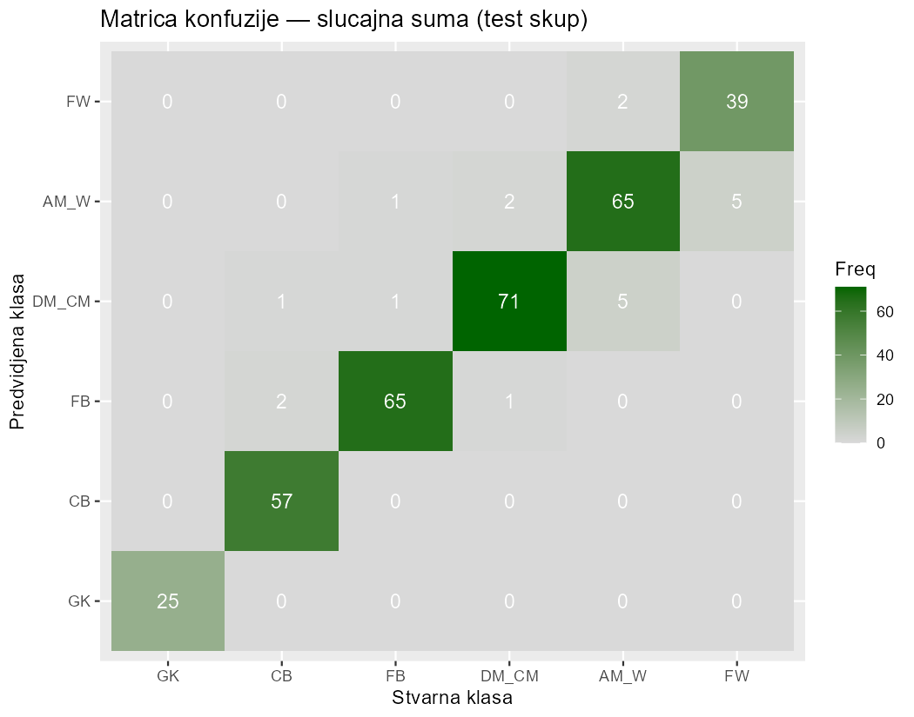
```

Struktura grešaka istovetna je onoj kod stabla. Devetnaest od 20 grešaka javlja
se između susednih klasa, a jedini izuzetak je ponovo bočni odbrambeni igrač
svrstan među krila. **Ansambl nije promenio prirodu grešaka, već samo njihov
broj.**

Rang liste značaja obeležja dva metoda spajaju se radi neposrednog poređenja:

```{r kod-rf-poredjenje-imp}
imp <- spark_jobj(rf_stage) %>% invoke("featureImportances") %>% invoke("toArray")
imp_df <- data.frame(obelezje = feat_cols, znacaj = round(imp, 4)) %>%
  arrange(desc(znacaj))

if (file.exists("results/dt_importance.csv")) {
  dt_imp <- read.csv("results/dt_importance.csv")
  poredjenje <- merge(imp_df, dt_imp, by = "obelezje",
                      suffixes = c("_suma", "_stablo")) %>%
    arrange(desc(znacaj_suma))
  write.csv(poredjenje, "results/importance_poredjenje.csv", row.names = FALSE)
}
```

```{r rf-importance, eval=TRUE, echo=FALSE, fig.cap="Slika 18: Značaj obeležja — slučajna šuma"}
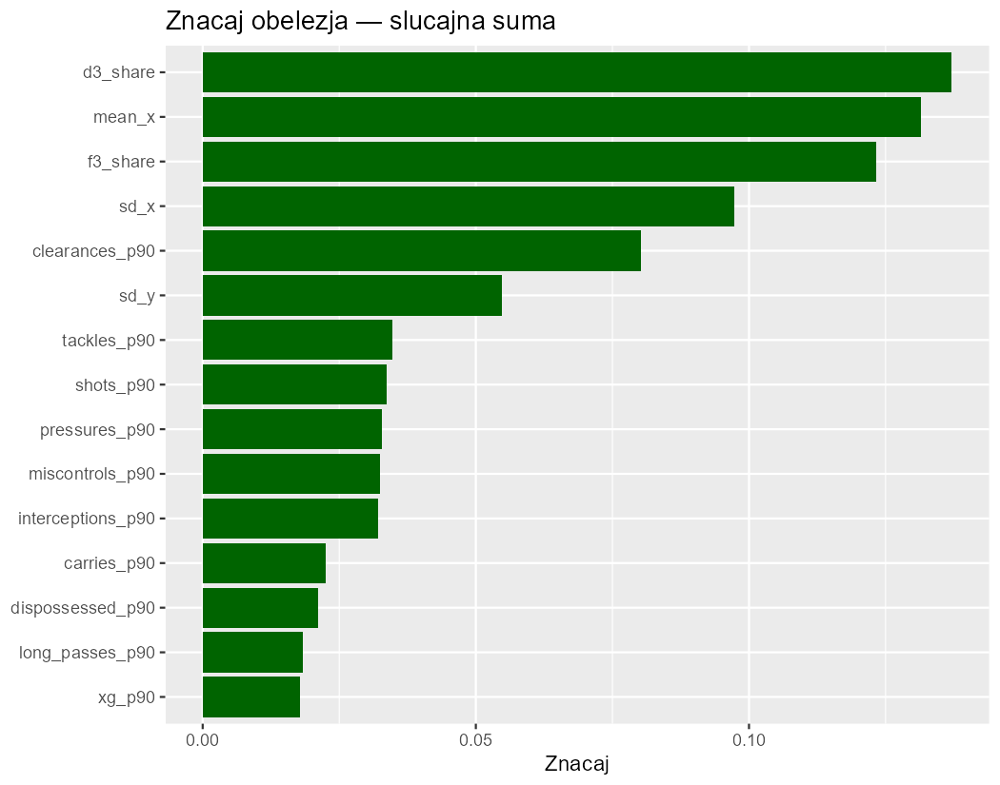
```

| Obeležje | Slučajna šuma | Stablo odlučivanja |
|---|---|---|
| `d3_share` | 0,1371 | 0,0702 |
| `mean_x` | 0,1315 | **0,6028** |
| `f3_share` | 0,1232 | 0,0065 |
| `sd_x` | 0,0973 | 0,1218 |
| `clearances_p90` | 0,0802 | **0,0000** |
| `sd_y` | 0,0547 | **0,0000** |
| `tackles_p90` | 0,0347 | **0,0000** |
| `shots_p90` | 0,0336 | 0,0223 |
| `pressures_p90` | 0,0328 | 0,0146 |
| `miscontrols_p90` | 0,0324 | **0,0000** |
| `interceptions_p90` | 0,0321 | 0,1012 |
| `carries_p90` | 0,0226 | 0,0278 |

*Tabela 15: Značaj obeležja — slučajna šuma naspram stabla odlučivanja*

Poređenje otkriva suštinsku razliku u načinu na koji dva metoda koriste obeležja.
Kod stabla je značaj izrazito skoncentrisan: `mean_x` nosi 60,3%, a prva četiri
obeležja 89,6%. Kod šume je raspodela znatno ravnomernija: najznačajnije obeležje
nosi 13,7%, a prva četiri 48,9%.

Uzrok je u nasumičnom izboru podskupa obeležja. Obeležje `mean_x` nije dostupno u
većini grananja, pa stablo mora posegnuti za srodnim obeležjima. Posledica je
najuočljivija kod četiri obeležja — `clearances_p90`, `sd_y`, `tackles_p90` i
`miscontrols_p90` — koja izabrano stablo nije upotrebilo nijednom, dok u ansamblu
zajedno nose 20,2% značaja.

Poredak značaja u šumi znatno je bliži rezultatima analize varijanse nego poredak
iz stabla, što je očekivano: analiza varijanse meri pojedinačnu diskriminativnu
moć svakog obeležja nezavisno od ostalih, a upravo takvu meru ansambl bolje
aproksimira. Praktični zaključak jeste da značaj obeležja u pojedinačnom stablu
treba tumačiti oprezno u prisustvu korelisanih obeležja.

## Metod k najbližih suseda

Spark se ovde koristi samo za učitavanje istovetne podele, nakon čega se veza
zatvara — trening matrica 1360 × 29 u potpunosti staje u memoriju, pa bi
zadržavanje izvršilaca tokom duge R faze bilo trošenje 8 GB bez dobiti.

Da bi brojevi ostali uporedivi sa Spark cevovodima, težinska F1 mera
implementirana je sa **definicijom istovetnom** onoj u
`MulticlassClassificationEvaluator(metric_name = "f1")`:

```{r kod-knn-f1}
f1_weighted <- function(actual, predicted, levels_ = lvl) {
  tab  <- table(factor(predicted, levels = levels_),
                factor(actual,    levels = levels_))   # redovi: predviđanja
  tp   <- diag(tab)
  prec <- tp / rowSums(tab)          # imenilac: koliko puta je klasa predviđena
  rec  <- tp / colSums(tab)          # imenilac: koliko puta se klasa javlja
  f1   <- 2 * prec * rec / (prec + rec)
  f1[!is.finite(f1)] <- 0            # klasa koja nije ni predviđena ni prisutna
  w    <- colSums(tab) / sum(tab)    # težine po učestalosti stvarne klase
  sum(w * f1)
}
```

Standardizacija se, kao i u cevovodu, uči **isključivo na trening delu svakog
preklopa**; ugrađeno skaliranje u `kknn` je isključeno jer bi ga radilo nad celim
skupom:

```{r kod-knn-scale}
scale_pair <- function(A, B) {
  m <- colMeans(A); s <- apply(A, 2, stats::sd)
  s[s == 0 | is.na(s)] <- 1
  list(A = scale(A, center = m, scale = s),
       B = scale(B, center = m, scale = s))
}

knn_predict <- function(Xa, ya, Xb, yb, k, distance, kernel) {
  dtr <- data.frame(Xa, y = ya, check.names = FALSE)
  dte <- data.frame(Xb, y = yb, check.names = FALSE)
  kknn::kknn(y ~ ., train = dtr, test = dte,
             k = k, distance = distance, kernel = kernel,
             scale = FALSE)          # skaliranje smo već uradili sami
}
```

Unakrsna validacija je pisana ručno, sa **stratifikovanim** preklopima, pa su
sačuvani rezultati svih deset preklopa i time je dostupna i standardna devijacija,
koju `ml_validation_metrics` ne vraća:

```{r kod-knn-cv}
set.seed(42)
folds <- caret::createFolds(ytr, k = 10, list = TRUE, returnTrain = FALSE)

cv_knn <- function(k, distance = 2, kernel = "rectangular") {
  vapply(folds, function(idx) {
    s   <- scale_pair(Xtr[-idx, , drop = FALSE], Xtr[idx, , drop = FALSE])
    fit <- knn_predict(s$A, ytr[-idx], s$B, ytr[idx], k, distance, kernel)
    f1_weighted(ytr[idx], fit$fitted.values)
  }, numeric(1))
}

run_grid <- function(grid) {
  bind_rows(lapply(seq_len(nrow(grid)), function(i) {
    f1s <- cv_knn(grid$k[i], grid$distance[i], grid$kernel[i])
    cbind(grid[i, , drop = FALSE],
          f1    = round(mean(f1s), 4),
          f1_sd = round(stats::sd(f1s), 4),
          f1_se = round(stats::sd(f1s) / sqrt(length(f1s)), 4))
  }))
}

g1 <- expand.grid(k = c(1,3,5,7,9,11,15,21,31,51),
                  distance = 2, kernel = "rectangular", stringsAsFactors = FALSE)
g2 <- expand.grid(k = c(5,9,15,21,31), distance = 2,
                  kernel = c("rectangular","triangular","gaussian","inv"),
                  stringsAsFactors = FALSE)
g3 <- expand.grid(k = c(5,9,15,21,31), distance = c(1,2,3),
                  kernel = "rectangular", stringsAsFactors = FALSE)
```

KNN je lenj klasifikator: ne postoji faza obučavanja u pravom smislu, model je
sam trening skup, a sve računanje je pomereno na trenutak predikcije.

### Scenario 1 — broj suseda

```{r knn-s1, eval=TRUE, echo=FALSE}
tab(knn_s1, "Tabela 16 — KNN, scenario 1: broj suseda")
```

```{r knn-s1-fig, eval=TRUE, echo=FALSE, fig.cap="Slika 19: KNN, uticaj broja suseda (trake greške su ±1 SE)"}
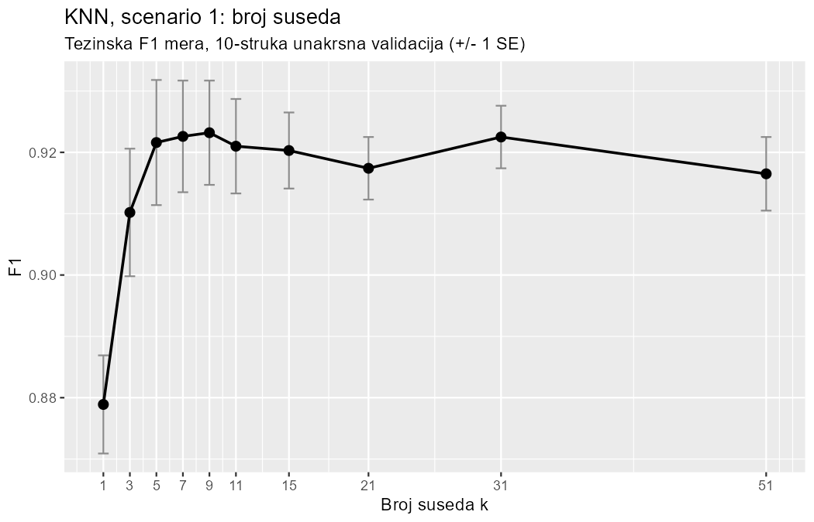
```

Za k = 1 model pamti pojedinačne instance i F1 pada na 0,8789 — to je jedina
konfiguracija koja se ubedljivo izdvaja od ostalih. Već od k = 5 kriva se
izravnava i ostaje u pojasu 0,917–0,923 sve do k = 51, gde blago preglačavanje
granica počinje da smanjuje rezultat. Zapaža se i da standardna devijacija po
preklopima monotono opada sa porastom k (0,0321 za k = 5 naspram 0,0160 za
k = 21), što je direktna posledica usrednjavanja preko više suseda.

### Scenario 2 — ponderisanje glasova suseda

```{r knn-s2, eval=TRUE, echo=FALSE}
tab(knn_s2, "Tabela 17 — KNN, scenario 2: funkcija jezgra")
```

```{r knn-s2-fig, eval=TRUE, echo=FALSE, fig.cap="Slika 20: KNN, način ponderisanja glasova suseda"}
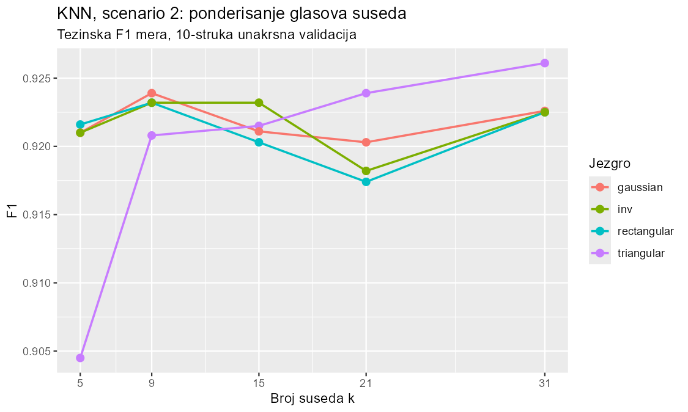
```

Struktura rezultata je poučna: **ponderisanje pomaže samo pri velikim k.** Za
k = 5 trougaono jezgro je najgore u celom scenariju (0,9045), jer sa malo suseda
agresivno smanjivanje težine najudaljenijih efektivno svodi odluku na dva do tri
glasa i vraća nestabilnost sličnu onoj kod k = 1. Pri k = 31 isto jezgro postaje
najbolje (0,9261), jer prigušuje doprinos dalekih suseda koji više ne pripadaju
lokalnom susedstvu.

### Scenario 3 — metrika rastojanja

```{r knn-s3, eval=TRUE, echo=FALSE}
tab(knn_s3, "Tabela 18 — KNN, scenario 3: Minkowski parametar")
```

```{r knn-s3-fig, eval=TRUE, echo=FALSE, fig.cap="Slika 21: KNN, uticaj metrike rastojanja"}
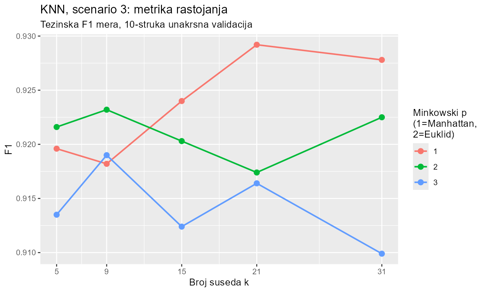
```

Ovo je scenario sa najizraženijim uticajem. Manhattan rastojanje je najbolje pri
većim k (0,9292 za k = 21), dok je p = 3 dosledno najslabije u svih pet tačaka.
Objašnjenje leži u dimenzionalnosti prostora: sa 29 standardizovanih obeležja
veći p sve više dopušta da jedno jedino obeležje sa velikim odstupanjem dominira
rastojanjem, pa se susedstvo određuje na osnovu izuzetka umesto na osnovu ukupnog
profila igrača. Manhattan metrika sabira apsolutna odstupanja ravnomerno i zato je
otpornija.

### Izbor rešenja i ocena na test skupu

Izabrana konfiguracija je **k = 21, Manhattan rastojanje (p = 1), neponderisano
glasanje**, sa CV F1 = 0,9292 (SE = 0,0079).

Izbor treba tumačiti uz ogradu. Ukupan raspon svih 45 ispitanih konfiguracija je
0,8789–0,9292, a tipična standardna greška po preklopima iznosi 0,0071. Razlika
između najboljih rezultata tri scenarija (0,9232, 0,9261, 0,9292) manja je od
jedne standardne greške, pa se ne može tvrditi da je izabrana konfiguracija
statistički značajno bolja od desetak drugih. Jedini nalazi koji izlaze izvan
šuma jesu slabost k = 1 i sistematska prednost Manhattan metrike nad p = 3.

| Pokazatelj | Vrednost |
|---|---|
| F1 iz unakrsne validacije (10 preklopa) | 0,9292 |
| Tačnost na test skupu | 0,9357 |
| 95% interval poverenja | (0,904 – 0,959) |
| Koenov koeficijent kapa | 0,9214 |
| Težinska F1 na test skupu | 0,9359 |
| Makro preciznost | 0,9398 |
| Makro odziv | 0,9447 |
| Makro F1 | 0,9416 |
| Balansirana tačnost | 0,9658 |
| Višeklasni AUC (Hand–Till) | 0,9962 |
| Priprema referentnog skupa | 0,11 s |
| Vreme predviđanja nad test skupom | 0,32 s |
| Broj ocenjenih modela u pretrazi | 451 |

*Tabela 19: Pokazatelji performansi izabranog KNN modela*

```{r knn-po-klasi, eval=TRUE, echo=FALSE}
tab(knn_po_klasi, "Tabela 20 — KNN: performanse po pozicionim klasama")
```

```{r knn-confusion, eval=TRUE, echo=FALSE, fig.cap="Slika 22: Matrica konfuzije — KNN"}
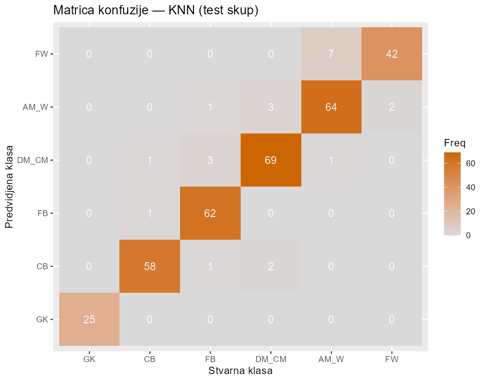
```

Od ukupno 22 greške, devet otpada na par AM_W–FW. To je i jedini par sa
dvosmernom konfuzijom i objašnjava zašto FW ima najnižu preciznost (0,857), a
AM_W najniži odziv (0,889). Greška nije tehnička nego suštinska: kod modernih
formacija krilo koje se učestalo useca u kazneni prostor i pomereni napadač imaju
gotovo istovetan profil dodira, prodora i prostorne raspodele.

AUC od 0,9962 je visok, ali ga treba čitati oprezno: kod neponderisanog jezgra
verovatnoće su umnošci 1/21, pa je rezolucija rangiranja gruba i mera manje
informativna nego kod metoda koji daju glatke verovatnoće.

Profil troška je karakterističan za lenjo učenje: „obučavanje" traje 0,11 s jer se
svodi na formiranje referentne tabele, dok predviđanje traje tri puta duže iako se
odnosi na četiri puta manji skup. Kod stabla i šume odnos je obrnut. Zanimljiv je
i odnos vremena po scenarijima: S1 sa svega 10 kombinacija traje 15,8 s, dok S2 sa
20 kombinacija traje 6,7 s, jer S1 sadrži k = 51, a složenost pretrage suseda raste
sa k. **Kod KNN-a broj kombinacija nije dobar pokazatelj cene** — merodavna je
vrednost k i broj instanci.

KNN nema ugrađenu meru značaja, pa je primenjen **permutacioni značaj**: svako
obeležje se nasumično promeša u test skupu i meri se pad težinske F1 mere:

```{r kod-knn-imp}
set.seed(42); REPS <- 5
base_f1 <- f1_weighted(yte, final$fitted.values)

drops <- vapply(seq_along(feat_cols), function(j) {
  mean(replicate(REPS, {
    Xp <- s_full$B
    Xp[, j] <- sample(Xp[, j])            # promešaj samo j-to obeležje
    fp <- knn_predict(s_full$A, ytr, Xp, yte,
                      best_row$k, best_row$distance, best_row$kernel)
    base_f1 - f1_weighted(yte, fp$fitted.values)
  }))
}, numeric(1))
```

```{r knn-importance, eval=TRUE, echo=FALSE, fig.cap="Slika 23: Značaj obeležja — KNN (permutacioni)"}
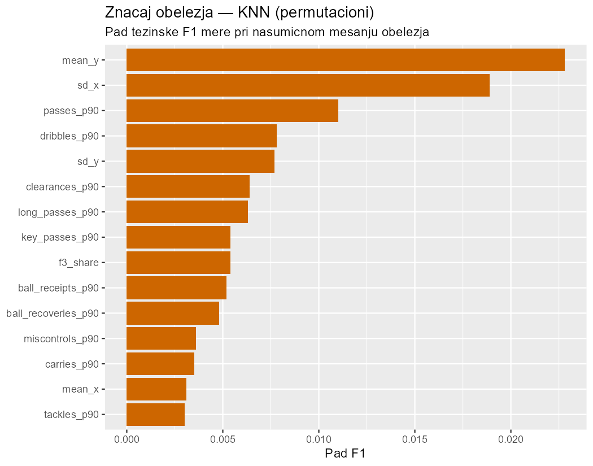
```

Dva prostorna obeležja dominiraju: `mean_y` nosi 19% ukupnog pada, a `sd_x` još
16%.

Dve ograde pri tumačenju. Prvo, ovo nije ista skala kao Gini značaj kod stabla i
šume, koji se po definiciji sabira na 1 — uporediv je redosled, ne apsolutna
vrednost. Drugo, **permutacioni značaj potcenjuje obeležja koja su međusobno
korelisana**: ako dva obeležja nose istu informaciju, mešanje jednog ne škodi jer
drugo ostaje netaknuto, pa oba deluju nevažno. Upravo to objašnjava zašto se
`mean_y` nalazi na prvom mestu iako po analizi varijanse nije ni među prvih pet —
nema jak korelat u skupu, pa se njegovo mešanje ne može nadoknaditi.

## Izbor rešenja na nivou svih metoda

### Kriterijum izbora

Izbor je vođen F1 merom iz unakrsne validacije, dakle istim kriterijumom
primenjenim i pri izboru parametara unutar svakog metoda. Test skup nije korišćen
kao kriterijum izbora, već isključivo kao nezavisna potvrda. Pri približno
jednakim vrednostima primenjena su dopunska merila — struktura grešaka, cena
predviđanja, ponašanje pri porastu obima podataka i mogućnost tumačenja modela.

Pošto sve tri skripte snimaju red sa **istovetnim imenima kolona**, poređenje se
svodi na spajanje tri fajla:

```{r kod-poredjenje}
putanje <- c(KNN = "results/knn_best.csv",
             DT  = "results/dt_best.csv",
             RF  = "results/rf_best.csv")
postoje <- putanje[file.exists(putanje)]

svi <- bind_rows(lapply(postoje, read.csv)) %>% arrange(desc(cv_f1))
pobednik <- svi$metod[which.max(svi$cv_f1)]

svi %>%
  select(metod, cv_f1, test_tacnost, makro_f1, bal_tacnost) %>%
  tidyr::pivot_longer(-metod, names_to = "pokazatelj", values_to = "vrednost") %>%
  ggplot(aes(pokazatelj, vrednost, fill = metod)) +
  geom_col(position = "dodge") +
  coord_cartesian(ylim = c(0.8, 1.0)) +
  labs(title = "Poređenje klasifikacionih metoda",
       subtitle = "CV F1 sa trening skupa, ostalo sa test skupa",
       x = NULL, y = NULL, fill = "Metod")
ggsave("figures/POREDJENJE_metode.png", width = 8, height = 4.5, dpi = 150)
```

```{r poredjenje-tabela, eval=TRUE, echo=FALSE}
tab(poredjenje, "Tabela 21 — Poređenje sva tri klasifikaciona metoda")
```


### Poređenje po unakrsnoj validaciji

| Metod | CV F1 | Razlika u odnosu na najbolji |
|---|---|---|
| KNN | 0,9292 | — |
| Slučajna šuma | 0,9244 | −0,0048 |
| Stablo odlučivanja | 0,8857 | −0,0435 |

*Tabela 22: Poređenje po F1 meri iz unakrsne validacije*

Poređenje razdvaja dve jasno različite situacije.

**Stablo odlučivanja zaostaje za više od četiri procentna poena.** Razlika je
višestruko veća od standardne greške po preklopima, koja iznosi približno 0,007,
pa je nalaz nedvosmislen.

**Razlika između KNN-a i slučajne šume ne može se smatrati stvarnom.** Za to
postoje dva razloga. Prvi je statistički: 0,0048 je manje od jedne standardne
greške, pa se intervali preklapaju. Drugi je metodološki — iako je kod KNN-a
namerno primenjena istovetna definicija težinske F1 mere, dve vrednosti **nisu
nastale nad istim preklopima**. Kod stabla i šume preklope formira
`ml_cross_validator` bez stratifikacije, kod KNN-a `caret::createFolds` sa
stratifikacijom. Poređenje razlika reda veličine hiljaditih delova između dve
različite šeme preklapanja nije opravdano.

Primarni kriterijum, dakle, razdvaja stablo od preostala dva metoda, ali **ne
razdvaja slučajnu šumu od KNN-a.**

### Poređenje na test skupu

| Pokazatelj | Stablo | Slučajna šuma | KNN |
|---|---|---|---|
| Tačnost | 0,9123 | **0,9415** | 0,9357 |
| 95% interval poverenja | 0,877–0,940 | 0,911–0,964 | 0,904–0,959 |
| Koenova kapa | 0,8926 | **0,9284** | 0,9214 |
| Težinska F1 | 0,9131 | **0,9417** | 0,9359 |
| Makro preciznost | 0,9276 | **0,9513** | 0,9398 |
| Makro odziv | 0,9191 | **0,9448** | 0,9447 |
| Makro F1 | 0,9226 | **0,9476** | 0,9416 |
| Balansirana tačnost | 0,9504 | **0,9663** | 0,9658 |
| Višeklasni AUC | 0,9776 | **0,9966** | 0,9962 |
| Broj grešaka (od 342) | 30 | **20** | 22 |

*Tabela 23: Poređenje na nezavisnom test skupu*

Vrednosti težinske F1 mere na test skupu izvedene su iz F1 mera po klasama i
broja instanci po klasi, radi poređenja sa merom iz unakrsne validacije, koja je
takođe težinska.

**Poredak se obrnuo u odnosu na unakrsnu validaciju.** Slučajna šuma je bolja od
KNN-a po svih devet pokazatelja, dok je u unakrsnoj validaciji bila druga. Obrt
sam po sebi nije neuobičajen — test skup obuhvata 342 instance, pa razlika od dve
pogrešno klasifikovane instance pomera tačnost za 0,6 procentnih poena, a
intervali poverenja se u velikoj meri preklapaju. Ono što jeste značajno jeste
**doslednost**: šuma nije bolja u proseku uz slučajne izuzetke, nego u svakom
pojedinačnom pokazatelju.

| Klasa | Stablo | Slučajna šuma | KNN |
|---|---|---|---|
| GK | 1,0000 | 1,0000 | 1,0000 |
| CB | 0,9655 | **0,9744** | 0,9587 |
| FB | 0,9385 | **0,9630** | 0,9538 |
| DM_CM | 0,8846 | **0,9342** | 0,9324 |
| AM_W | 0,8630 | 0,8966 | **0,9014** |
| FW | 0,8837 | **0,9176** | 0,9032 |

*Tabela 24: F1 mera po pozicionim klasama, sva tri metoda*

Od pet netrivijalnih klasa slučajna šuma je najbolja u četiri, a KNN u jednoj.

### Struktura grešaka — zajednički plafon

| Par klasa | Stablo | Slučajna šuma | KNN |
|---|---|---|---|
| AM_W – FW | 10 | 7 | 9 |
| DM_CM – AM_W | 9 | 7 | 4 |
| FB – DM_CM | 6 | 2 | 3 |
| CB – DM_CM | 3 | 1 | 3 |
| CB – FB | 1 | 2 | 2 |
| FB – AM_W | 1 | 1 | 1 |
| **Ukupno** | **30** | **20** | **22** |

*Tabela 25: Raspodela grešaka po parovima klasa*

Ovo je najinformativniji deo poređenja. **Sva tri metoda greše na istim mestima.**
Dva para — krila i napadači, te centralni i ofanzivni vezni igrači — nose 63%
grešaka kod stabla, 70% kod šume i 59% kod KNN-a. Nijedan metod nema nijednu
grešku između klasa sa suprotnih krajeva spektra odbrana–napad, a par golmana
ostaje bez ijedne greške u sva tri slučaja.

Tri metoda sa suštinski različitim induktivnim pristupima — jedno stablo pravila,
ansambl od 500 stabala i metod zasnovan na rastojanju u prostoru od 29 dimenzija —
daju **istu strukturu grešaka.** Da je reč o nedostatku kapaciteta pojedinog
metoda, raspored grešaka bi se razlikovao. Doslednost pokazuje da je granica u
samim podacima, što je potpuno saglasno sa predviđanjem iz dijagrama glavnih
komponenata.

Razlike među metodama svode se na to koliko su blizu tog zajedničkog plafona.
Stablo je najdalje. Šuma i KNN su praktično na njemu, s tim da šuma bolje
razdvaja krila od napadača (7 naspram 9), a KNN centralne od ofanzivnih veznih
igrača (4 naspram 7).

### Poređenje značaja obeležja

```{r imp-sve, eval=TRUE, echo=FALSE}
tab(imp_sve, "Tabela 26 — Značaj obeležja kroz sva tri metoda")
```

Tri metoda daju tri različite rang liste, a razlike su posledica same
konstrukcije mera. Slučajna šuma daje listu najbližu analizi varijanse, stablo
najizobličeniju (60,3% u jednom obeležju), a KNN treću, opet drugačiju, jer
permutaciona mera potcenjuje korelisana obeležja. Zajednički nalaz, uprkos
razlikama u poretku, jeste da **prostorna obeležja dominiraju kod sva tri
metoda.**

### Cena i ponašanje pri porastu obima podataka

| Veličina | Stablo | Slučajna šuma | KNN |
|---|---|---|---|
| Obučavanje jednog modela | 2,60 s | 6,21 s | 0,11 s |
| Predviđanje nad 342 instance | 0,50 s | 0,42 s | 0,32 s |
| Broj modela u pretrazi | 273 | 263 | 451 |
| Veličina modela | 33 čvora | 21.544 čvora | matrica 1360 × 29 |
| Okruženje | Spark MLlib | Spark MLlib | R, `kknn` |

*Tabela 27: Cena obučavanja i predviđanja*

Najvažnija razlika za praktičnu primenu ne vidi se iz izmerenih vrednosti, jer je
skup od 1.702 igrača premali da bi je razotkrio. **Trošak predviđanja kod KNN-a
raste linearno sa veličinom trening skupa**, budući da za svaku novu instancu
treba izračunati rastojanje do svih 1.360 referentnih tačaka. Kod stabla i šume
trošak predviđanja **ne zavisi od veličine trening skupa** — određen je brojem
stabala i njihovom dubinom. Uz to, KNN mora čuvati ceo trening skup kao model; ne
postoji sažimanje naučenog u kompaktniji oblik.

### Izabrano rešenje

> **Kao konačno rešenje na nivou svih metoda izabrana je slučajna šuma sa 500
> stabala, maksimalnom dubinom 5 i strategijom `sqrt` pri izboru podskupa
> obeležja.**

Obrazloženje po koracima:

1. **Stablo odlučivanja isključeno je na osnovu unakrsne validacije.** Zaostatak
   od 0,0435 višestruko premašuje standardnu grešku i potvrđen je na test skupu,
   gde stablo pravi 50% više grešaka.
2. **Unakrsna validacija nije razdvojila šumu od KNN-a**, pa primarni kriterijum
   ne daje odgovor i primenjuju se dopunska merila.
3. **Doslednost na nezavisnom test skupu** — šuma je bolja po svih devet
   pokazatelja i po četiri od pet netrivijalnih klasa.
4. **Ponašanje pri porastu obima podataka** — trošak predviđanja kod šume ne
   zavisi od veličine trening skupa, dok kod KNN-a raste linearno. Za projekat
   postavljen nad podacima obima gigabajta to je odlučujuće svojstvo.
5. **Mogućnost tumačenja** — šuma daje meru značaja obeležja saglasnu sa analizom
   varijanse, dok se permutaciona zamena kod KNN-a pokazala izobličenom u
   prisustvu korelisanih obeležja.
6. **Kvalitet procene verovatnoća** — šuma daje glatko stepenovane verovatnoće,
   dok su kod KNN-a umnošci 1/21.

### Ograničenja izbora

Preklopi unakrsne validacije nisu istovetni za sva tri metoda. Ponavljanje celog
postupka nad zajedničkim, unapred fiksiranim preklopima uklonilo bi ovu
nesigurnost i omogućilo upareno poređenje po preklopima, što je znatno osetljiviji
postupak od poređenja srednjih vrednosti.

Za stablo i šumu raspoložive su samo srednje vrednosti po preklopima, jer
`ml_validation_metrics` ne vraća disperziju. Intervali poverenja iz unakrsne
validacije stoga su računati samo za KNN.

Test skup obuhvata 342 instance, pa jedna pogrešno klasifikovana instanca menja
tačnost za 0,29 procentnih poena. Razlika između šume i KNN-a od dve instance
nalazi se unutar te osetljivosti.

Pretraga parametara sprovedena je po scenarijima, kao odvojene celine, pa nijedno
od tri rešenja nije nužno najbolje moguće za taj metod.

# Klasterizacija

## Postavka

Klasterizacija je nenadgledani, deskriptivni postupak: cilj nije predviđanje već
opisivanje strukture koja u podacima postoji nezavisno od pozicionih oznaka.
Grupišu se **pojave**, dakle redovi tabele na nivou igrača, a ne obeležja.

Primenjen je **metod k sredina**, predstavnik klasterizacije podelom. Svaki igrač
pripada tačno jednom klasteru, klaster je predstavljen centroidom, a pripadnost se
određuje euklidskom udaljenošću od centroida.

Izbor metoda vođen je računskom složenošću. Metod k sredina ima složenost
O(k·s·t), dakle linearnu po broju entiteta, dok je hijerarhijska klasterizacija
između O(s² log s) i O(s³), a gustinska O(s log s). Pri obimu podataka na koji je
projekat postavljen jedino metod k sredina ostaje neposredno primenljiv i jedini
ima distribuiranu implementaciju u biblioteci Spark MLlib.

Za razliku od metoda k najbližih suseda, gde je Minkowski parametar bio predmet
trećeg scenarija, ovde mera različitosti **nije slobodan parametar**: metod je
definisan preko euklidske udaljenosti, budući da se centroid računa kao
aritmetička sredina članova. Metrika stoga ne može biti scenario.

Analiza je sprovedena nad **celim skupom od 1.702 igrača.** Podela na trening i
test deo formirana je zbog klasifikacije i u nenadgledanom postupku nema svrhu.

```{r kod-km-ucitavanje}
train <- spark_read_parquet(sc, "train", sp("data/interim/train"))
test  <- spark_read_parquet(sc, "test",  sp("data/interim/test"))
dat   <- sdf_bind_rows(train, test)          # ceo skup: 1702 igrača

dat_r <- dat %>% select(all_of(c(feat_cols, "position_group"))) %>% collect()
Xraw  <- as.matrix(dat_r[, feat_cols])
poz   <- factor(dat_r$position_group, levels = lvl)   # SAMO za tumačenje

Xs <- scale(Xraw, center = TRUE, scale = TRUE)
```

Centriranje i skaliranje rešavaju poznatu osetljivost metoda na razmeru obeležja:
bez toga bi `passes_p90`, reda veličine desetina, dominiralo u udaljenosti nad
udelima u rasponu od 0 do 1. Euklidska udaljenost nad standardizovanim podacima
ekvivalentna je standardizovanoj euklidskoj nad izvornim vrednostima.

Dva prostora obeležja pripremaju se odvojenim cevovodima. PCA se primenjuje **nad
standardizovanim** podacima, jer `ft_pca` ne centrira samostalno:

```{r kod-km-cevovodi}
prep_std <- ml_pipeline(sc) %>%
  ft_vector_assembler(input_cols = feat_cols, output_col = "features_raw") %>%
  ft_standard_scaler("features_raw", "features", with_mean = TRUE, with_std = TRUE)

prep_pca <- ml_pipeline(sc) %>%
  ft_vector_assembler(input_cols = feat_cols, output_col = "features_raw") %>%
  ft_standard_scaler("features_raw", "features_std", with_mean = TRUE, with_std = TRUE) %>%
  ft_pca(input_col = "features_std", output_col = "features", k = 11)

tbl_std <- ml_transform(ml_fit(prep_std, dat), dat)
tbl_pca <- ml_transform(ml_fit(prep_pca, dat), dat)
```

Kao mere kvaliteta korišćene su dve veličine.

**Unutarklasterska varijabilnost W(C)**, definisana kao zbir kvadriranih
euklidskih udaljenosti po svim uređenim parovima entiteta unutar klastera,
podeljen brojem članova. Važi identitet W(C) = 2·SSE(C), jer je

$$\sum_{i,j \in C} \lVert x_i - x_j \rVert^2 = 2\,\lvert C\rvert \sum_{i \in C} \lVert x_i - c \rVert^2 .$$

```{r kod-km-w}
sse <- function(X, cl) {
  sum(vapply(unique(cl), function(g) {
    Xi <- X[cl == g, , drop = FALSE]
    if (nrow(Xi) < 2) return(0)
    sum(sweep(Xi, 2, colMeans(Xi))^2)
  }, numeric(1)))
}
W_ukupno <- function(X, cl) 2 * sse(X, cl)

# provera identiteta: preko svih parova naspram preko odstupanja od centroida
provera_W <- function(Xi) {
  d2    <- as.matrix(dist(Xi))^2
  W_par <- 2 * sum(d2[upper.tri(d2)]) / nrow(Xi)
  W_sse <- 2 * sum(sweep(Xi, 2, colMeans(Xi))^2)
  c(preko_parova = W_par, preko_sse = W_sse)
}
```

Identitet je numerički proveren nad klasterom golmana: oba puta 1.806.

**Siluetni koeficijent** računa se objektom `ml_clustering_evaluator`. Prilagođeni
Randov indeks i mera čistoće takođe su računati, ali **nisu korišćeni kao
kriterijum izbora** — oba se oslanjaju na pozicione oznake, pa bi njihova upotreba
pri izboru broja klastera pretvorila postupak u nadgledan:

```{r kod-km-mere}
evaluator_sil <- ml_clustering_evaluator(
  sc, features_col = "features", prediction_col = "prediction",
  metric_name = "silhouette")

cistoca <- function(cl, klase) {
  tab <- table(cl, klase); sum(apply(tab, 1, max)) / sum(tab)
}

ari <- function(cl, klase) {                 # prilagođeni Randov indeks
  tab <- table(cl, klase); n <- sum(tab)
  c2 <- function(x) x * (x - 1) / 2
  suma_ij <- sum(c2(tab)); suma_i <- sum(c2(rowSums(tab)))
  suma_j  <- sum(c2(colSums(tab)))
  ocek <- suma_i * suma_j / c2(n)
  (suma_ij - ocek) / (0.5 * (suma_i + suma_j) - ocek)
}

oceni_k <- function(tbl, X, k, oznaka, init_mode = "k-means||", seed = 42) {
  model <- ml_kmeans(tbl, formula = NULL, k = k, features_col = "features",
                     init_mode = init_mode, max_iter = 50, seed = seed)
  tr <- ml_transform(model, tbl)
  pr <- tr %>% select(prediction) %>% collect() %>% pull(prediction)
  data.frame(prostor = oznaka, k = k,
             W = round(W_ukupno(X, pr), 1), SSE = round(sse(X, pr), 1),
             silueta = round(ml_evaluate(evaluator_sil, tr), 4),
             najmanji = min(table(pr)), najveci = max(table(pr)),
             cistoca = round(cistoca(pr, poz), 4),
             ari = round(ari(pr, poz), 4))
}
```

## Scenario 1 — broj klastera

Broj klastera je jedini parametar koji metod zahteva unapred i to je njegova
poznata mana. Ispitano je devet vrednosti, od 2 do 10.

```{r kod-km-s1}
K_RANGE <- 2:10
vm1 <- bind_rows(lapply(K_RANGE, function(k) oceni_k(tbl_std, Xs, k, "29 obelezja")))

# relativni pad W — brojčana dopuna vizuelnom pravilu lakta
vm1 <- vm1 %>% mutate(pad_W = round(c(NA, -diff(W)) / lag(W) * 100, 1))
```

```{r km-s1, eval=TRUE, echo=FALSE}
tab(km_s1, "Tabela 28 — k sredina, scenario 1: broj klastera")
```

```{r km-s1-fig, eval=TRUE, echo=FALSE, fig.cap="Slika 25: k sredina, metod lakta i siluetni koeficijent"}
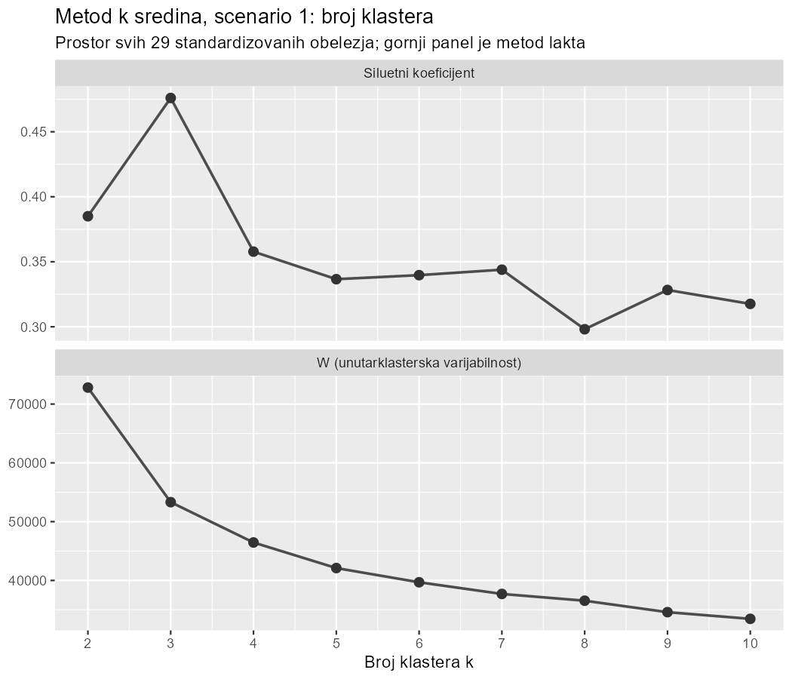
```

**Oba kriterijuma pokazuju na istu vrednost.** Metod lakta: pad unutarklasterske
varijabilnosti iznosi 26,8% pri prelasku sa dva na tri klastera, zatim 12,9%, pa
9,4%, i dalje ostaje ispod šest procenata. Lakat je jasno izražen pri **k = 3**.
Siluetni koeficijent nezavisno dostiže maksimum na istoj vrednosti, 0,4760, pri
čemu je druga najbolja vrednost 0,3850.

Saglasnost dva kriterijuma je značajna, jer mere različite stvari: lakat ocenjuje
kompaktnost klastera, silueta odnos kompaktnosti i razdvojenosti. Vrednost 0,4760
na uobičajenoj skali tumačenja spada u opseg slabe ali postojeće strukture, što je
pošteno očekivanje za skup u kojem pet od šest pozicionih klasa obrazuje kontinuum.

Zapaža se i da najmanji klaster ima tačno 125 članova pri svakoj vrednosti k od 3
do 8 — koliko ima i golmana u skupu.

## Scenario 2 — prostor obeležja

Par `d3_share`–`mean_x` ima koeficijent korelacije −0,980. Kod metoda zasnovanih
na udaljenosti redundantna obeležja višestruko uračunavaju istu informaciju i time
je implicitno ponderišu, čime menjaju samu meru različitosti. Isti opseg vrednosti
k ispitan je nad 11 glavnih komponenata, koje nose 90,35% ukupne varijanse i po
konstrukciji su ortogonalne.

```{r kod-km-s2}
Xp <- prcomp(Xs, center = FALSE, scale. = FALSE)$x[, 1:11]
vm2_pca <- bind_rows(lapply(K_RANGE, function(k) oceni_k(tbl_pca, Xp, k, "11 komponenti")))
vm2 <- bind_rows(vm1 %>% select(-pad_W), vm2_pca)
```

```{r km-s2, eval=TRUE, echo=FALSE}
tab(km_s2, "Tabela 29 — k sredina, scenario 2: poređenje prostora obeležja")
```

```{r km-s2-fig, eval=TRUE, echo=FALSE, fig.cap="Slika 26: k sredina, poređenje dva prostora obeležja"}
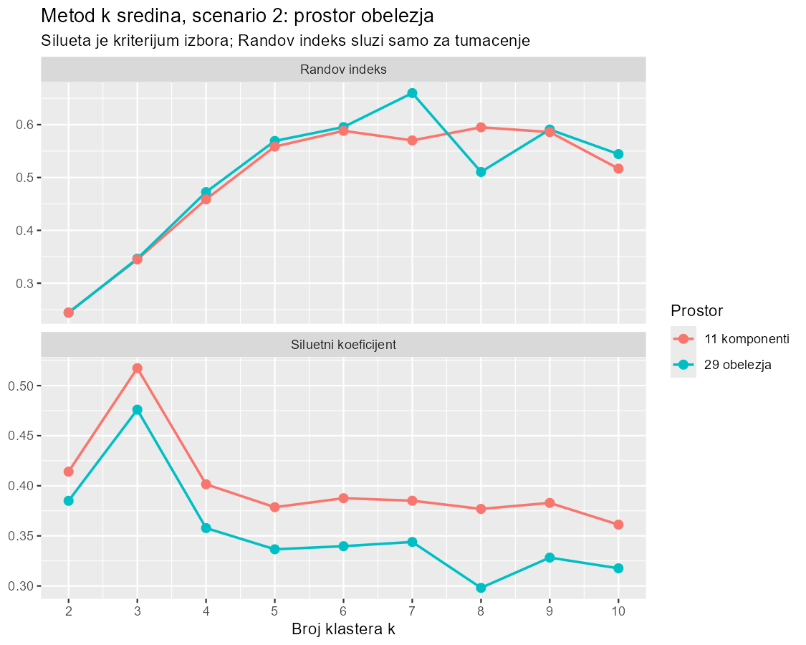
```

**Napomena o poređenju:** apsolutne vrednosti W i SSE **nisu uporedive između dva
prostora**, jer 11 komponenata sadrži samo 90,35% ukupne varijanse, pa je i ukupna
varijabilnost koju treba objasniti manja. Uporediv je normalizovani udeo
objašnjene varijabilnosti, 1 − SSE(k)/SSE(1), gde je SSE(1) = 49.329 za prostor
svih obeležja i 44.569 za prostor komponenata. Pri k = 3 to je 46,0% naspram
50,8%. Siluetni koeficijent i Randov indeks su bezdimenzioni i neposredno
uporedivi.

Nalaz je dvostruk.

**Redukcija dimenzionalnosti poboljšava kvalitet podele.** Siluetni koeficijent je
viši u prostoru komponenata pri svih devet vrednosti k, u proseku za 0,04.
Objašnjenje je upravo ono predviđeno u odeljku o korelacijama: uklanjanjem
redundanse svaka nezavisna dimenzija varijabilnosti ulazi u udaljenost tačno
jednom.

**Redukcija ne menja šta klasteri hvataju.** Pri k = 3 čistoća je identična
(0,4636 u oba slučaja), a Randov indeks praktično isti (0,3465 naspram 0,3450).
Struktura je ista, samo je u prostoru komponenata jasnije razgraničena.

Oba prostora nezavisno biraju k = 3, čime je izbor iz prvog scenarija potvrđen.

## Stabilnost rešenja

Metod k sredina konvergira ka lokalnom optimumu i osetljiv je na početni raspored,
pa se preporučuje više pokretanja sa različitim početnim stanjima.

```{r kod-km-stabilnost}
stabilnost <- bind_rows(lapply(c("k-means||", "random"), function(im) {
  bind_rows(lapply(c(1, 7, 42, 2024, 31337), function(s) {
    r <- oceni_k(tbl_std, Xs, 3, "29 obelezja", init_mode = im, seed = s)
    data.frame(init = im, seme = s, W = r$W, silueta = r$silueta, ari = r$ari)
  }))
}))
```

```{r km-stabil, eval=TRUE, echo=FALSE}
tab(km_stabil, "Tabela 30 — Provera stabilnosti rešenja pri k = 3")
```

Raspon vrednosti W kroz svih deset pokretanja iznosi **0,1**, a raspon siluetnog
koeficijenta **0,0002**. Način inicijalizacije nije napravio razliku. Rešenje je,
dakle, potpuno stabilno i nije zarobljeno u lošem lokalnom optimumu.

## Izabrano rešenje i struktura klastera

Izabrana su **tri klastera nad prostorom svih 29 standardizovanih obeležja.**
Broj klastera potvrđen je trostruko: metodom lakta, siluetnim koeficijentom i
nezavisnim ponavljanjem u prostoru glavnih komponenata. Za analizu strukture
zadržan je prostor svih obeležja, iako je silueta u prostoru komponenata viša
(0,5174 naspram 0,4760), zbog tumačivosti — centroidi u prostoru izvornih
obeležja imaju neposredno fudbalsko značenje.

```{r kod-km-final}
model <- ml_kmeans(tbl_std, formula = NULL, k = 3, features_col = "features",
                   init_mode = "k-means||", max_iter = 50, seed = 42)

klaster <- ml_transform(model, tbl_std) %>%
  select(prediction) %>% collect() %>% pull(prediction)
klaster <- factor(paste0("C", klaster + 1))     # C1..C3 umesto 0..2

ukrstena <- table(klaster, poz)                 # tek sada se koriste pozicije
```

```{r km-best, eval=TRUE, echo=FALSE}
if (!is.null(km_best)) {
  km_best |>
    select(-any_of(c("silueta", "udeo_negativne"))) |>
    tab("Tabela 31 — Pokazatelji izabranog rešenja")
}
```

| Klaster | Broj članova | GK | CB | FB | DM_CM | AM_W | FW |
|---|---|---|---|---|---|---|---|
| C1 | 125 | **125** | 0 | 0 | 0 | 0 | 0 |
| C2 | 966 | 0 | **300** | **325** | **320** | 21 | 0 |
| C3 | 611 | 0 | 0 | 7 | 48 | **339** | **217** |

*Tabela 32: Odnos klastera i pozicionih klasa*

Čistoća iznosi 0,4636, a prilagođeni Randov indeks 0,3465. Obe vrednosti na prvi
pogled deluju nisko i, uzete same za sebe, navele bi na pogrešan zaključak.
Tabela pokazuje suprotno.

**Nijedna pozicija nije rasuta po klasterima:**

| Klasa | Dominantni klaster | Udeo u njemu |
|---|---|---|
| GK | C1 | 100,0% |
| CB | C2 | 100,0% |
| FB | C2 | 97,9% |
| DM_CM | C2 | 87,0% |
| AM_W | C3 | 94,2% |
| FW | C3 | 100,0% |

*Tabela 33: Pokrivenost pozicionih klasa dominantnim klasterom*

Ako se klasteri protumače kao nadgrupe — C1 golmani, C2 odbrana i vezni red, C3
napad — onda **1.626 od 1.702 igrača, odnosno 95,5%, pripada klasteru koji
odgovara njegovoj nadgrupi.**

Niska čistoća, dakle, ne znači nesaglasnost, nego **grubost podele.** Mera čistoće
za svaki klaster uzima udeo samo najbrojnije klase, pa klaster C2, koji ravnomerno
sadrži tri pozicione klase (CB 31,1%, FB 33,6%, DM_CM 33,1%), dobija ocenu od
svega 33,6% iako u njemu nema nijednog stranog elementa osim 21 ofanzivnog veznog
igrača. Isto važi za Randov indeks, koji kažnjava spajanje klasa čak i kada je
spajanje potpuno dosledno.

Suštinski nalaz jeste da **nenadgledani postupak otkriva tri nadgrupe, a ne šest
pozicija, i da su te nadgrupe ugnježdene u pozicioni poredak bez ukrštanja.**
Granica između C2 i C3 prolazi između centralnih i ofanzivnih veznih igrača,
dakle na sredini spektra odbrana–napad.

```{r km-pca-klasteri, eval=TRUE, echo=FALSE, fig.cap="Slika 27: Klasteri u prostoru glavnih komponenata"}
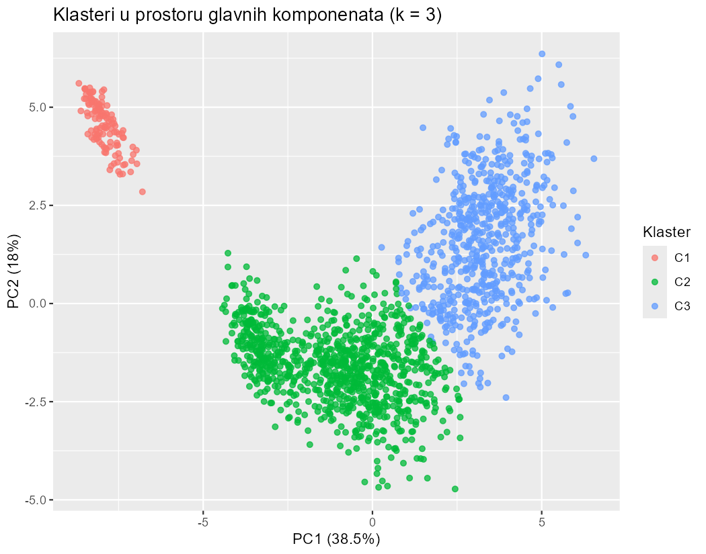
```

```{r km-pca-pozicije, eval=TRUE, echo=FALSE, fig.cap="Slika 28: Iste tačke obojene po pozicionoj klasi"}
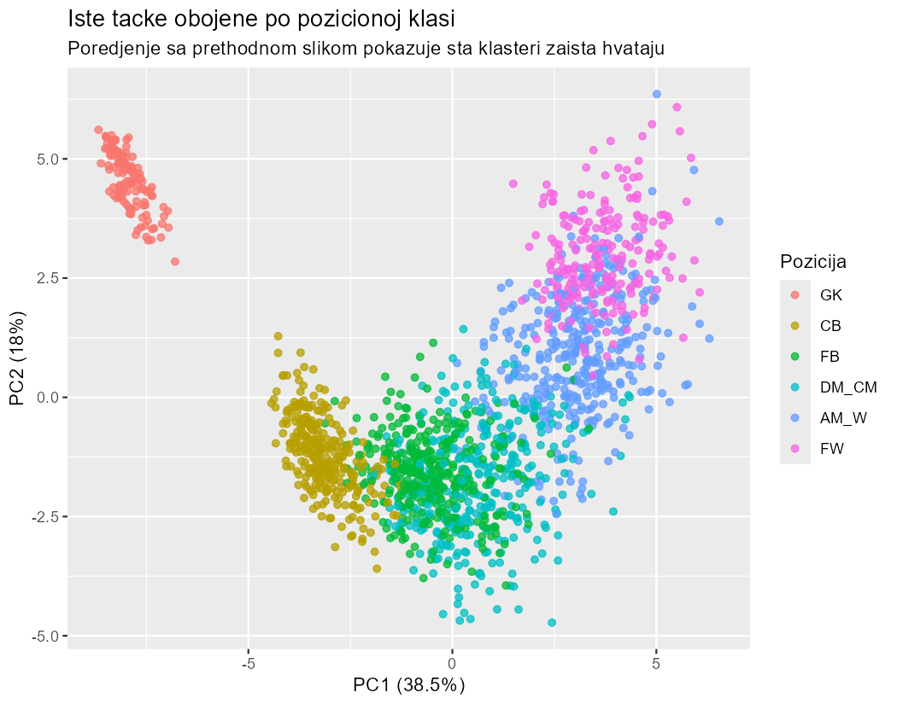
```

Poređenje dve slike najneposrednije pokazuje šta klasteri hvataju: raspored tačaka
je isti, a boje se razlikuju samo po tome što klasterizacija spaja susedne
pozicione klase u nadgrupe.

Odnos siluete i Randovog indeksa iskazuje isto brojčano. Siluetni koeficijent,
nenadgledana mera, ima maksimum pri k = 3. Prilagođeni Randov indeks, koji meri
slaganje sa pozicijama, ima maksimum pri **k = 7** (0,6598), gde čistoća dostiže
0,8719. **Za slaganje sa pozicionim oznakama potrebno je više klastera nego što ih
struktura gustine nudi.** Dve krive imaju maksimume na različitim mestima, i to
razmimoilaženje je glavni kvantitativni rezultat ove celine.

```{r km-silueta, eval=TRUE, echo=FALSE, fig.cap="Slika 29: Siluetni profil izabranog rešenja"}
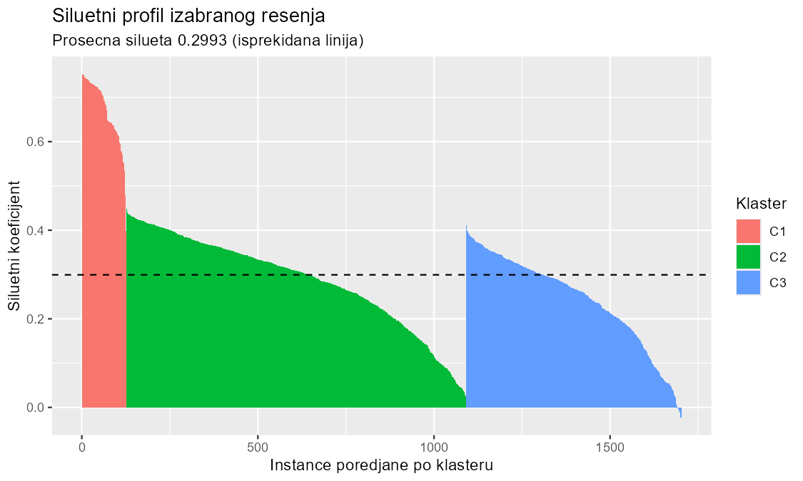
```

Klaster golmana ima izrazito visoku prosečnu siluetu, dok su C2 i C3 znatno niži —
očekivano, jer dele granicu koja u podacima nije oštra. Udeo instanci sa
negativnom siluetom je ispod jednog procenta, što znači da gotovo nijedan igrač
nije očigledno pogrešno smešten.

## Odnos vrednosti obeležja i pripadnosti klasteru

Koja obeležja podelu određuju utvrđuje se jednofaktorskom analizom varijanse sa
klasterom kao faktorom, a profil se prikazuje toplotnom mapom centroida:

```{r kod-km-profili}
f_vred <- vapply(feat_cols, function(f)
  summary(aov(Xs[, f] ~ klaster))[[1]][["F value"]][1], numeric(1))
f_df <- data.frame(obelezje = names(f_vred), F_vrednost = round(f_vred, 1)) %>%
  arrange(desc(F_vrednost))

centroidi <- as.data.frame(t(sapply(levels(klaster), function(g)
  colMeans(Xs[klaster == g, , drop = FALSE]))))
centroidi$klaster <- rownames(centroidi)

top_f <- head(f_df$obelezje, 15)
centroidi %>%
  select(klaster, all_of(top_f)) %>%
  pivot_longer(-klaster, names_to = "obelezje", values_to = "z") %>%
  mutate(obelezje = factor(obelezje, levels = rev(top_f))) %>%
  ggplot(aes(klaster, obelezje, fill = z)) +
  geom_tile() + geom_text(aes(label = sprintf("%.1f", z)), size = 2.8) +
  scale_fill_gradient2(low = "steelblue4", mid = "white", high = "firebrick",
                       midpoint = 0) +
  labs(title = "Profili klastera",
       subtitle = "Centroidi u standardizovanim jedinicama; 0 je prosek celog skupa",
       x = "Klaster", y = NULL, fill = "z")
ggsave("figures/KM_centroidi.png", width = 7.5, height = 6.5, dpi = 150)
```

```{r km-obelezja, eval=TRUE, echo=FALSE}
if (!is.null(km_obelezja)) {
  km_obelezja |> head(12) |>
    tab("Tabela 34 — Obeležja koja najviše razdvajaju klastere (ANOVA F)")
}
```

Prvih šest obeležja poklapa se, uz izmenjen redosled, sa prvih sedam po
diskriminativnoj moći u odnosu na poziciju. Grupe koje je algoritam pronašao nisu,
dakle, definisane nekim skrivenim obeležjem, nego istim onim veličinama koje
razdvajaju i pozicije — samo grublje.

Na prvom mestu je `avg_pass_length`, obeležje koje izabrano stablo odlučivanja
nije upotrebilo nijednom, jer je u prisustvu obeležja `mean_x` bilo suvišno. Ovde
je najjače, jer klasterizacija ne bira jedno obeležje po grananju nego koristi sva
istovremeno kroz euklidsku udaljenost. Golmani sa dugim izbačajima i napadači sa
kratkim dodavanjima u skučenom prostoru nalaze se na suprotnim krajevima te ose.

```{r km-centroidi-fig, eval=TRUE, echo=FALSE, fig.cap="Slika 30: Profili klastera — centroidi u standardizovanim jedinicama"}
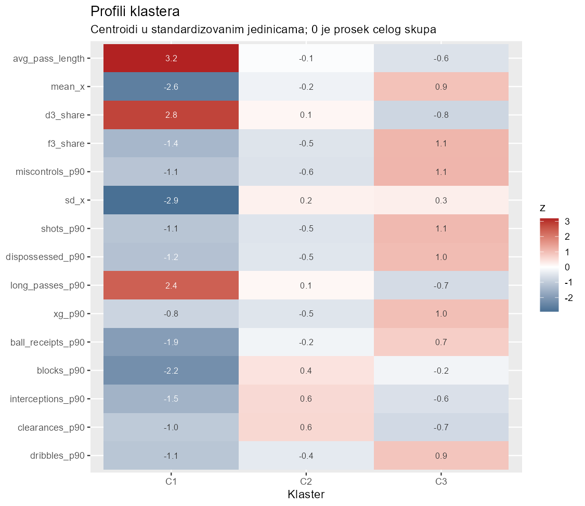
```

Profil klastera ima jasnu strukturu duž dve ose.

**Prostorna osa** razdvaja sva tri klastera: `mean_x`, `d3_share` i `f3_share`
menjaju predznak i veličinu od C1 preko C2 do C3, prateći pomeranje težišta od
sopstvenog gola ka protivničkom.

**Osa rizika u posedu** razdvaja pretežno C2 od C3. Obeležja `miscontrols_p90` i
`dispossessed_p90` nalaze se visoko na listi, iznad `shots_p90`. Igrači u
napadačkoj trećini gube loptu znatno češće, jer primaju loptu pod pritiskom, u
skučenom prostoru i leđima okrenuti golu. To je obeležje ponašanja, a ne položaja,
i predstavlja drugi nezavisan izvor razdvajanja.

```{r km-centroidi-tabela, eval=TRUE, echo=FALSE}
if (!is.null(km_centroidi)) {
  km_centroidi |>
    select(any_of(c("klaster", "n", "mean_x", "d3_share", "f3_share",
                    "avg_pass_length", "miscontrols_p90", "shots_p90"))) |>
    tab("Tabela 35 — Centroidi u izvornim jedinicama (izbor obeležja)", digits = 2)
}
```

```{r km-sastav, eval=TRUE, echo=FALSE, fig.cap="Slika 31: Sastav klastera po pozicionim klasama"}
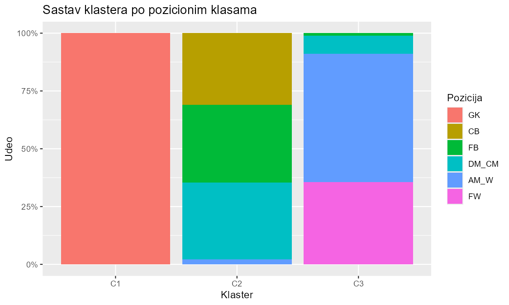
```

```{r km-boxplot, eval=TRUE, echo=FALSE, fig.cap="Slika 32: Raspodela obeležja po klasterima"}
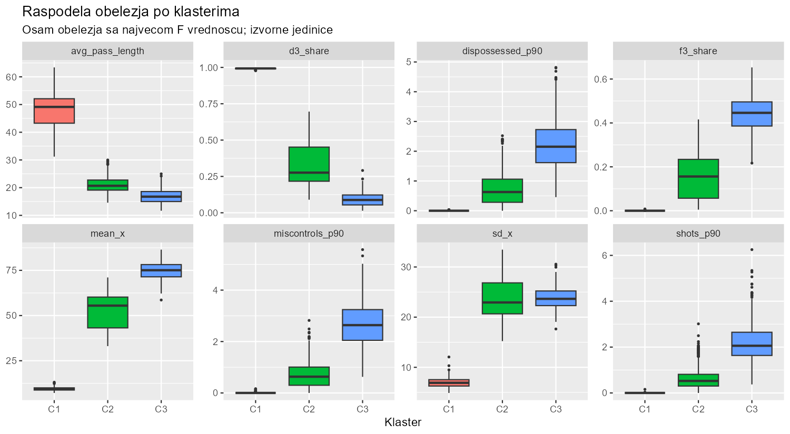
```

Kutijasti dijagrami u izvornim jedinicama potvrđuju da razdvajanje nije posledica
pojedinačnih odudarajućih vrednosti nego pomeranja celih raspodela.

# Zaključak

Analizirano je 5.321.459 događaja iz 1.517 utakmica četiri evropske lige,
agregiranih u tabelu na nivou igrača sa 1.702 reda i 29 numeričkih obeležja.

**Prostorna obeležja određuju poziciju.** Analiza varijanse pokazala je da najjače
prostorno obeležje ima diskriminativnu moć 5,6 puta veću od najjačeg brojača
događaja. Isti nalaz nezavisno potvrđuju sva tri klasifikaciona metoda kroz meru
značaja obeležja, kao i klasterizacija. Pozicija igrača pouzdanije se očitava iz
toga gde se igrač kreće nego iz toga koje akcije izvodi.

**Izabrano klasifikaciono rešenje je slučajna šuma** sa 500 stabala, dubinom 5 i
strategijom `sqrt`, koja na test skupu postiže tačnost 0,9415, Koenovu kapu
0,9284, makro F1 meru 0,9476 i višeklasni AUC 0,9966. Unakrsna validacija nije
razdvojila šumu od metoda k najbližih suseda, pa je izbor dopunjen doslednošću na
test skupu, ponašanjem pri porastu obima podataka i mogućnošću tumačenja.

**Pozicione uloge su kontinuum, ne diskretne kategorije.** Ovaj nalaz pojavljuje
se četiri puta nezavisno: na dijagramu glavnih komponenata, u strukturi grešaka
sva tri klasifikatora, u razmimoilaženju siluetnog koeficijenta i Randovog indeksa
pri klasterizaciji, i u sastavu dobijenih klastera. Nenadgledani postupak
prepoznaje tri nadgrupe — golmane, igrače sa težištem u sopstvenoj polovini i
igrače sa težištem u protivničkoj — sa slaganjem od 95,5%, ali ne i šest
pojedinačnih pozicija.

**Preostala greška je svojstvo podataka, ne metoda.** Sva tri klasifikatora greše
na istim parovima klasa, u istom rasporedu, a nijedan ne meša klase sa suprotnih
krajeva spektra. Napredak preko postignutog nivoa verovatnije bi doneo rad na
obeležjima nego dalje podešavanje parametara.

# Ograničenja

1. Ciljne klase izvedene su iz modalne pozicije, pa 25 višepozicionih igrača
   (1,5% skupa) ima manje pouzdanu oznaku.
2. Modeli koriste agregate po sezoni i ne uzimaju u obzir kontekst pojedinačne
   utakmice ni protivnika.
3. Prostorna obeležja zasnovana su na prosečnim koordinatama i disperziji, pa se
   gubi detaljna struktura kretanja.
4. Nijedan metod nije ispitan nad potpunom kombinatornom mrežom hiperparametara.
   Kod slučajne šume je to i konkretno pokazano: kombinacija velikog broja stabala
   i dubine 10 nije ispitana, a oba scenarija je nagoveštavaju kao verovatno
   povoljniju.
5. Preklopi unakrsne validacije nisu istovetni za sva tri metoda — Spark deli
   nasumično, `caret::createFolds` stratifikuje.
6. Metod k sredina formira sferične klastere približno jednakog obima. Gustinski
   postupak dao bi dopunski uvid, ali nema distribuiranu implementaciju u MLlib.
7. Klasterizacija je izvršena nad skupom obeležja biranim prema diskriminativnoj
   moći u odnosu na poziciju, što je nadgledan kriterijum. Nenadgledana analiza nad
   drugačije biranim skupom mogla bi otkriti strukturu koja sa pozicijom nema veze.
8. Pokušano je i poređenje sa bisekcionim metodom k sredina, zanimljivim zato što
   su bisekcije na istom nivou hijerarhije međusobno nezavisne i mogu se izvršavati
   paralelno. Funkcija `ml_bisecting_kmeans` u korišćenoj verziji paketa
   `sparklyr` vratila je jedan klaster umesto traženih tri, pa poređenje nije
   sprovedeno.

Moguća unapređenja: više sezona, obeležja po fazama igre, kontekst rezultata
utakmice, poređenje sa gustinskim metodama klasterizacije i primena metoda
pojačavanja gradijenta.

# Ponovljivost

Sve skripte koriste fiksirano seme 42. Redosled izvršavanja:

```{r reproduktivnost}
source("scripts/00_preuzmi_podatke.R")                 # preuzimanje podataka
source("scripts/01_data_processing_with_sparklyr.R")   # Spark obrada, obeležja
source("scripts/03_null_values_analysis.R")            # nedostajuće vrednosti
source("scripts/04_EDA.R")                             # preliminarna analiza
source("scripts/05_train_test_split.R")                # podela na trening i test
source("scripts/06_dt.R")                              # stablo odlučivanja
source("scripts/07_rf.R")                              # slučajna šuma
source("scripts/08_knn.R")                             # k najbližih suseda
source("scripts/09_kmeans.R")                          # klasterizacija
```

Izveštaj se kompajlira sa `rmarkdown::render("report_rvpii.Rmd")`. Blokovi koji
pokreću Spark imaju `eval = FALSE`; tabele se čitaju iz `results/`, a slike iz
`figures/`, pa kompajliranje ne zahteva ponovno izvršavanje analize.

```{r session, eval=TRUE}
sessionInfo()
```

# Prilog: potpune skripte

```{r prilog, eval=TRUE, echo=FALSE, results='asis'}
skripte <- c(
  "scripts/00_preuzmi_podatke.R",
  "scripts/01_data_processing_with_sparklyr.R",
  "scripts/03_null_values_analysis.R",
  "scripts/04_EDA.R",
  "scripts/05_train_test_split.R",
  "scripts/06_dt.R",
  "scripts/07_rf.R",
  "scripts/08_knn.R",
  "scripts/09_kmeans.R"
)

for (put in skripte) {
  cat("\n\n## `", basename(put), "`\n\n", sep = "")
  if (file.exists(put)) {
    cat("```r\n"); cat(readLines(put), sep = "\n"); cat("\n```\n")
  } else {
    cat("*Fajl nije pronađen: `", put, "`*\n", sep = "")
  }
}
```

# Literatura

1. StatsBomb. *StatsBomb Open Data*. <https://github.com/statsbomb/open-data>
2. Apache Spark. *MLlib: Machine Learning Library*. <https://spark.apache.org/mllib/>
3. Breiman, L. (2001). *Random Forests*. Machine Learning, 45(1), 5–32.
4. Cover, T. i Hart, P. (1967). *Nearest Neighbor Pattern Classification*. IEEE Transactions on Information Theory, 13(1), 21–27.
5. MacQueen, J. (1967). *Some Methods for Classification and Analysis of Multivariate Observations*.
6. Hand, D. J. i Till, R. J. (2001). *A Simple Generalisation of the Area Under the ROC Curve for Multiple Class Classification Problems*. Machine Learning, 45, 171–186.
7. Rousseeuw, P. J. (1987). *Silhouettes: a graphical aid to the interpretation and validation of cluster analysis*. Journal of Computational and Applied Mathematics, 20, 53–65.
8. Kuhn, M. *caret: Classification and Regression Training*.
9. Hechenbichler, K. i Schliep, K. *kknn: Weighted k-Nearest Neighbors*.
